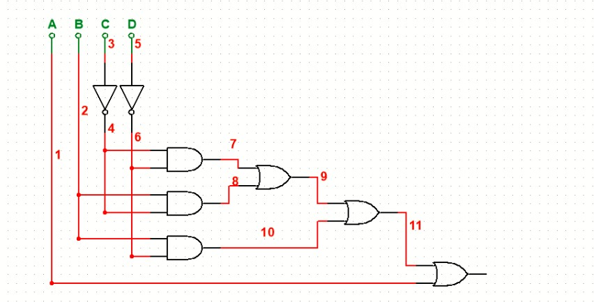

# Circuito decodificador
## 1 Resumen 
En este informe se describe la implementación de un decodificador de Gray en la FPGA por medio de un sistema digital de un código en HDL básico, el cual se subdivide en sistemas donde el primero consiste en la lectura del código Gray, el despliegue y traducción al formato binario para presentarlo en luces LED y por último el despliegue del código ingresado y decodificado al display de 7 segmentos en código decimal..
## 2 Introducción 
En la actualidad se trabaja con diseños digitales altamente complejos que necesitan ayuda asistida por la computadora, por lo que es vital aprender lenguajes de descripción de hardware como el HDL, que es utilizado en la síntesis de diseños digitales para ser fabricados en silicio o en FPGA. Las FPGAs son circuitos integrados reconfigurables que, de acuerdo con su programación, implementan una especificación funcional a partir de un código HDL.

Un código binario es la representación de 0 y 1 usado para la representación de texto o procesadores de instrucciones de las computadoras, ya que 0 representa apagado (sin carga eléctrica) y 1 encendido (con carga eléctrica); sin embargo, de acuerdo con los dispositivos que se utilizan, pueden estar invertidos. Estos números también tienen su representación en números decimales que, de acuerdo con la posición y cantidad de ceros y unos, representan un número decimal.

Asimismo, el código Gray es un sistema de numeración binario en el que dos números consecutivos solo difieren en un dígito. Fue diseñado para prevenir señales falsas, pero actualmente es usado para facilitar la corrección de errores en los sistemas de comunicaciones.
## 3 Objetivos 
### Objetivos
- Realizar una lectura de código Gray para decodificarlo tanto en formato binario como decimal y representarlos en las luces LED y en el display de 7 segmentos seguidamente. 
- Elaborar un sistema digital del circuito decodificador utilizando lenguajes de descripción de hardware en una FPGA.
- Construir los testbench de cada módulo para comprobar las especificaciones del diseño.
## 4 Diseño
### 4.1 Descripción general del funcionamiento del circuito completo y cada subsistema
#### Modulo principal 
Se va a empezar describiendo el modulos principal
```SystemVerilog
module principal (
   input logic [3:0] Gray,
   input logic [3:0] bin,
   input logic btn_in, 
   output logic [3:0] Led,
   output logic pin_uni,
   output logic pin_dec,
   output logic a, b, c, d, e, f, g,  // Salidas para el 7 segmentos uniades
   output logic bd, cd  // Salidas para el 7 segmentos de decenas
);

logic [3:0] bin_todos;
```
En este sección del código se inicial el `module` definiendole sus entradas y salidas
-Entradas 
Se definen las entradas que se nesecitan donde:
`Gray` se la van a poder ingresar 4 valores enumerador de 0 hasta 3 al igul que el `bin`.
Se agrgo un boton `btn_in` que es el que va a activar el 1 de las decenas.

Salidas
Despues de describir la salidas donde:
`Led` es la salida que va a presentar los numeros decodifcados del condigo Gray.
`pin_uni` y `pin_dec` son son pines encargados de ubicar la salida de la conexion que va a tener la resistencia de la base de los trsnsistores npn.
`a`,`b`,`c`, etc son las salidas que van a estar conectadas a los segmentos del display de la unidades.
`bd` y `cd` son las unicas dos salidas que van a estar conectadas al display de las decenas para el uno.
`bin_todos` es la variable interna donde se guarda el numero decodificado de Gray.

```SystemVerilog
// Instancia
gray_to_binary g_to_b_inst (
   .Gray(Gray),
   .bin(bin_todos)
);

// Instancia
binary_leds b_to_l_inst (
   .bin(bin_todos),
   .Led(Led)
);

assign pin_uni = btn_in ? 1'b0 : 1'b1;
assign pin_dec = btn_in ? 1'b1 : 1'b0;


decodificador_siete decodificador_unidades_inst (
   .bin(bin_todos),
   .a(a), .b(b), .c(c), .d(d), .e(e), .f(f), .g(g)
);

// Control para mostrar el número 1 en las decenas cuando el botón esté presionado
decodificador_decenas decodificador_decenas_inst (
   .btn_in(btn_in),   
   .bd(bd), .cd(cd)
);
```
Se contiua con las instancias que llaman a otros dos modulos diferenres dentro del modul principal.
- La primera instancia es `g_to_b_inst` que es del modulo `gray_to_binary` que se va a describir más adelante:
    - Lo que hace esta instancia es la lectura del codigo Gray a codigo binario conectando la señal de entrada Gray a la entrada del módulo y la salida binaria resultante se asigna a bin_todos. 

-La segunda instancia es `b_to_l_inst` que es del modulo ` binary_leds` que se describe más adelante:
    - Lo que hace esta instancia es tomar el numero decodificado y pasarlo a las luces LED.
Lo que hacen los `assign` es verificar si se esta trabajando con unidades o decenas y deacuerdo a al resultado desactiva el display de las decenas o el de las unidades.

- La tercer instancia `decodificador_unidades_inst` que es del modulo `decodificador_siete` que también se dercribe su funcionamiento más adelante:
    - Lo que hace esta intancia es agarrar el codigo decodificado en binario y enviarselo a los segmentos del display de las unidades para decirle cuales luces LED se encianden y cuales no. 
    
- La cuarta instancia `decodificador_decenas_inst` que es del module `decodificador_decenas` que se va a explicar más:
    - Lo que hace es que al igual que la instancia anterior envia la señal de cuales LEDs del display se enciende.

#### Module gray_to_binary (Lectura y decodificación)
```SystemVerilog
 module gray_to_binary (
    input logic [3:0] Gray,
    output logic [3:0] bin   
 );

   logic b3, b2, b1, b0;

   assign b3 = Gray[3];
   assign b2 = b3 ^ Gray[2];
   assign b1 = b2 ^ Gray[1];
   assign b0 = b1 ^ Gray[0];

   assign bin = {b3,b2,b1,b0};

 endmodule
```
En este modulo se vuelven a definir cuales son sus entradas las cuales son `Gray` y `bin`  respectivamente. 

Se definene las señales internas para codificar los bits `logic b3, b2, b1, b0`. 
-`b3` es el bit más significativo por lo que tambien va a representar el `Gray[3]`.
-`b2` es el rultado del la operacion de la compuarta XOR entre `b3` y `Gray[3]` y así sucesivamente para lo demas resultados.

Por ultimo se concatenan para formar el número binario completo en el `bin` y finalisa el modulo.

```SystemVerilog
module binary_leds (
    input logic [3:0]bin,
    output logic [3:0] Led
 );

   assign bin[3] = Led[3];
   assign bin[2] = Led[2];
   assign bin[1] = Led[1];
   assign bin[0] = Led[0];

 endmodule
 ```
 Este modulo lo que hace es controlar los LEDs de acuerdo a los valores obtenidos en el `bin` y representarlo en los LEDs donde un LED encendido significa un 1 y LED apagado significa un LED apagado, siendo en Led[3] el más significativo.

 ```SystemVerilog
 module decodificador_siete (
   input logic [3:0] bin,
   output logic a, b, c, d, e, f, g
);

   assign a = (~bin[1] & ~bin[3]) | (bin[1] & bin[3]) | bin[2] | bin[0];
   assign b = (~bin[0] & ~bin[1]) | (~bin[3]) | (bin[0] & bin[1]);
   assign c = (~bin[0]) | (bin[3]) | (bin[1]);
   assign d = (~bin[1] & ~bin[3]) | (~bin[0] & bin[1] & bin[3]) | (bin[0] & ~bin[1]) | (bin[0] & ~bin[3]);
   assign e = (~bin[1] & ~bin[3]) | (bin[0] & ~bin[1]);
   assign f = (~bin[0] & ~bin[1]) | (~bin[0] & bin[3]) | bin[2] | (~bin[1] & bin[3]);
   assign g = bin[2] | (~bin[0] & bin[3]) | (bin[0] & ~bin[3]) | (~bin[1] & bin[3]);

endmodule
```
En este modulo e igual que los anteriores se definen cuales van a ser la variables de entrada y cuales son las salidas siando en este caso `bin` la entrada y `a`,`b`,etc las salidas.

De acuerdo a los valores que se encuantren en el ``bin` se encarga de enviarle al 7 segmentos cuales LEDs se deben encender y cuales no vajo la cundicion de que si se obtine un 1 se enciande y si se obtiene un 0 se queda apagado. 
Esto de acuerdo a las ecuaciones buleanas que se le fueron asignadas a cada letra de los segmentos.

Un ejemplo pare el segmento a: 
- `assign a = (~bin[1] & ~bin[3]) | (bin[1] & bin[3]) | bin[2] | bin[0];`
    - a se enciende si se cumple alguna de estas condiciones:
    - bin[1] y bin[3] son ambos 0, o ambos son 1.
    - bin[2] es 1.
    - bin[0] es 1.

```SystemVerilog
module decodificador_decenas (
   input logic btn_in,
   output logic bd, cd
);

   // Cuando el botón está presionado, se muestra el número 1
   assign bd = btn_in ? 1'b1 : 1'b0;
   assign cd = btn_in ? 1'b1 : 1'b0;


endmodule
```
Se definen las entradas y las salidas como en cada modulo anterior donde `btn_in` en las entrada y `bd` y `cd` las salidas.

Este modulo se encraga de habilitar cual de los segmentos se enciande deacuerdo a las unidades que se este trabajando el cual se le va a indicar si el boton enta encendido con un 1 o apagado con un 0 y en el caso de que se este trabjando con las decenas se envia las señaes para que se muestre un uno en el display.

### 4.2 Diagramas de bloques de cada subsistema y su funcionamiento fundamental
#### Segmento a
Diagrama de bloque:


-Este segmento se enciende si bin[2] o bin[0] son 1, o si bin[1] y bin[3] son ambos 0 o ambos 1.

#### Segmento b
Diagrama de bloque:


- Este segmento se enciende si bin[3] es 0, o si bin[0] y bin[1] son ambos 0, o si ambos son 1.

#### Segmento c
Diagrama de bloque:


- Este segmento se enciende si bin[0] es 0, o bin[3] es 1, o bin[1] es 1.

#### Segmento d
Diagrama de bloque:


- Este segmento se enciende si bin[1] y bin[3] son ambos 0, o si bin[0] es 0 y bin[1] y bin[3] son 1, o si bin[0] es 1 y bin[1] es 0, o si bin[0] es 1 y bin[3] es 0.

#### Segmento e
Diagrama de bloque:


- Este segmento se enciende si bin[1] y bin[3] son ambos 0, o si bin[0] es 1 y bin[1] es 0.

#### Segmento f
Diagrama de bloque:


- Este segmento se enciende si bin[0] y bin[1] son ambos 0, o si bin[0] es 0 y bin[3] es 1, o bin[2] es 1, o si bin[1] es 0 y bin[3] es 1.

#### Segmento g
Diagrama de bloque:


- Este segmento se enciende si bin[2] es 1, o si bin[0] es 0 y bin[3] es 1, o si bin[0] es 1 y bin[3] es 0, o si bin[1] es 0 y bin[3] es 1.

### 4.3 Un ejemplo de la simplificación de las ecuaciones booleanas 


### 4.4 Ejemplo y análisis de una simulación funcional del sistema completo, desde el estímulo de entrada hasta el manejo de los 7 segmentos.

Para comprobar el funcionamiento correcto del sistema desarrollado, se realizó la creación de un Testbench, el cual tiene como finalidad, crear una simulación del sistema, para verificar su correcto funcionamiento, esto antes de implementarlo a la FPGA. Para ello se desarrolló el módulo principal_tb con las siguientes variables declaradas como logic.

```SystemVerilog
module principal_tb;
    logic [3:0] gray;
    logic [3:0] bit_4;
    logic [3:0] leds;
    logic a, b, c, d, e, f, g;
    logic btn_in;
    logic bd, cd;
    .
    .
    .
endmodule
```

De ello se utilizaron todas las variables en los módulos instanciados en el módulo principal_tb, dado que se crearon varios módulos para realizar diferentes tareas, estos se instancian para poder utilizarlos e interconectarlos y realizar la simulación como un sistema conjunto.

```SystemVerilog
module principal_tb;
    .
    .
    .
    gray_to_binary g_t_inst (
        .Gray(gray),
        .bin(bit_4)
    );

    binary_leds b_l_inst (
        .bin(bit_4),
        .Led(leds)
    );

    decodificador_siete d_s_inst(
        .bin(bit_4),
        .a(a), .b(b), .c(c), .d(d), .e(e), .f(f), .g(g)
    );

    decodificador_decenas d_d_inst(
        .btn_in(btn_in),
        .bd(bd), .cd(cd)
    );
    .
    .
    .
endmodule
```
Seguido de ello, para la realización de la simulación se les dio un valor a las variables gray, el correspondía a un código de binario, que simulaba si llegaba un voltaje a los pines de la FPGA, además se realizó la creación de un archivo llamado module_principal_tb.vcd, esto para observar las señales internas durante la simulación del sistema.

```SystemVerilog
module principal_tb;
    .
    .
    .
    initial begin

        gray = 4'b0000; #10;
        gray = 4'b0001; #10;
        .
        .
        gray = 4'b1110; #10;
        gray = 4'b1111; #10;
        $finish;
    end
    initial begin
        $dumpfile("module_principal_tb.vcd");
        $dumpvars(0, principal_tb);
    end

endmodule
```
De ello, al darle un valor a la variable gray, el módulo principal_tb toma el valor y utiliza la instancia de gray_to_binary, y convierte el código de gray a binario que toma la variable bit_4, a partir de esto, se utilizan las demás instancias, ya que dependen del valor de bit_4, donde las instancias de binary_leds y decodificador_siete, toman la variable bit_4 y en binary_leds, los leds toman el valor del código binario, esto para encender o apagar los leds y la instancia decodificador_siete, toma la variable bit_4 y lo codifica en un numero decimal, esto utilizando mapas de Karnaugh y el numero resultante se muestre en el siete-segmentos; por último la instancia de decodificador decenas, depende de la variable de btn_in, para que se muestre el número 1 en decimales, ya que se trabaja con 4 bits de entrada y el mayor número a alcanzar en decimal es 15, por lo que si se presiona el botón el segundo siete-segmentos mostrara el numero en la decenas que corresponde a un 1.


Con la herramienta de GTKwave, se logra visualizar el comportamiento de las ondas digitales, esto durante la simulación.

### 4.5 Análisis de consumo de recursos en la FPGA (LUTs, FFs, etc.) y del consumo de potencia que reporta las herramientas.

Para realizar el análisis de consumo de recursos, fue necesario realizar la simulación del sistema, el cual muestra cuantos recursos de la FPGA se van a utilizar, al realizar la simulación se obtuvieron los siguientes datos.

```SystemVerilog
2.28. Printing statistics.

=== principal ===

   Number of wires:                 37
   Number of wire bits:             67
   Number of public wires:          37
   Number of public wire bits:      67
   Number of memories:               0
   Number of memory bits:            0
   Number of processes:              0
   Number of cells:                 35
     IBUF                            9
     LUT1                            1
     LUT2                            2
     LUT3                            1
     LUT4                            7
     OBUF                           15
```
De ello, se destacan en el consumo de recursos lógicos en la FPGA como lo son los Look-up-Tables (LUTs), donde estos hacen referencia a el tamaño de tablas de búsqueda utilizadas, esto para implementar el sistema desarrollado con lógica combinacional, en nuestro diseño se utilizan 1 LUT1, que utiliza una entrada y funciones simples, dos LUT2 con 2 entradas y realiza funciones lógicas como AND, OR, XOR, un LUT3 con tres entradas y siete LUT4 que utiliza 4 entradas para realizar funciones lógicas más complejas.


Además al ejecutar el comando de "make pnr", se genera un reporte de utilización de recursos de la FPGA
```SystemVerilog
Info: Device utilisation:
Info: 	                 VCC:     1/    1   100%
Info: 	               SLICE:    11/ 8640     0%
Info: 	                 IOB:    24/  274     8%
Info: 	                ODDR:     0/  274     0%
Info: 	           MUX2_LUT5:     0/ 4320     0%
Info: 	           MUX2_LUT6:     0/ 2160     0%
Info: 	           MUX2_LUT7:     0/ 1080     0%
Info: 	           MUX2_LUT8:     0/ 1056     0%
Info: 	                 GND:     1/    1   100%
Info: 	                RAMW:     0/  270     0%
Info: 	                 GSR:     1/    1   100%
Info: 	                 OSC:     0/    1     0%
Info: 	                rPLL:     0/    2     0%
```
De esto se observa los pocos recursos utilizados en la FPGA, como el nodo de alimentación VCC, bloques de lógica SLICE, bloques de entrada y salida IOB, el nodo a tierra GND y GSR, para el reinicio de la FPGA.


## 5 Conclusiones
- Al concluir con este circuito, se puede resaltar la importancia de los mapas de Karnaugh, las tablas de verdad y la funcionalidad de las compuertas lógicas, ya que fueron de gran utilidad para simplificar las ecuaciones. Estos elementos son la base y la lógica necesaria para que el circuito se pueda ejecutar correctamente.
- Otro punto importante a destacar después de terminar este proyecto es la relevancia de saber programar en un lenguaje como el HDL. Esto permite estructurar y diseñar los circuitos electrónicos de manera que sea más fácil encontrar problemas o errores en el circuito. Además, facilita un análisis más detallado junto con una simulación realista.
- Después de terminar el circuito decodificador, se puede concluir que el circuito funciona de manera muy eficiente, dado que el consumo por parte de la FPGA es muy bajo al utilizar bloques y nodos.


## 6 Análisis de principales problemas hallados durante el trabajo y de las soluciones aplicadas.
A lo largo del trabajo se presentaron varios problemas, como:
- Inicialmente, no se tenía claro por dónde empezar. A pesar de haber visto los tutoriales del asistente, no se tenía una idea clara de qué era lo que se debía hacer específicamente. Sin embargo, a medida que se explicaba en la clase y conforme se le iba preguntando al asistente, y según sus respuestas, se empezó a diseñar la primera parte de la programación en SystemVerilog.
- Otros de los incombenientes era como programar porque apesar de que se tenia claro que era lo que se tenia que hacer aun se nesesitava escribirlo en el languaje de HDL, sin ningun funcion avansada por eso se busco en el libro, en las presentaciones que el profesor compartio y en el video tutorial del asistente para tener una idea de cuel era la extrutura que se debia seguir.Otro inconveniente fue la programación, ya que, aunque se tenía claro qué hacer, aún se necesitaba escribirlo en el lenguaje HDL sin usar funciones avanzadas. Por ello, se consultaron libros, las presentaciones compartidas por el profesor y el video tutorial del asistente para entender la estructura que se debía seguir.
-Después, se presentaron errores de sintaxis, los cuales fueron más tediosos porque no se sabía exactamente dónde estaban ubicados. Para resolverlos, se realizaron copias del código que sí funcionaba y se empezaron a hacer ajustes en las partes que presentaban errores.
- Finalmente, al crear el circuito físico, uno de los principales problemas fue que, en la lógica del diagrama del profesor, se trabajó con un display de ánodo común, pero en nuestro caso se nos proporcionó uno de cátodo común. Dado que ya se habían comprado todos los materiales para armar el circuito, surgieron dos opciones: buscar otros displays y trabajar con el transistor PNP, además de ajustar las ecuaciones, ya que estaban calculadas para un cátodo común, o volver a comprar un transistor NPN y simplemente reemplazar el anterior. Al final, se optó por la segunda opción porque se consideró que era la más viable.

## 7. Referencias
[1] David Harris y Sarah Harris. *Digital Design and Computer Architecture. RISC-V Edition.* Morgan Kaufmann, 2022. ISBN: 978-0-12-820064-3.

[2] D. Medina, "Tutorial: herramientas os FPGA TangNano9k," YouTube, Aug. 1, 2024. [Online]. Available: https://www.youtube.com/watch?v=AKO-SaOM7BA. [Accessed: Sep. 1, 2024].

[3] D. Josue MM, "open_source_fpga_environment," *GitHub*, Repository, Aug. 1, 2024. [Online]. Available: https://github.com/DJosueMM/open_source_fpga_environment/wiki. [Accessed: Sep. 1, 2024].


