# Diseño digital sincrónico de una suma aritmética en un HDL


## 1. Resumen
Este informe presenta los detalles de un programa digital sincrónico, el cual está programado en un lenguaje de hardware (HDL), captura los datos de un teclado hexadecimal y los almacena en binario para después implementar una función aritmética como la suma, y por último, desplegar el resultado en un display de 4 dígitos.

##### Introducción

Se aborda el diseño de un sistema digital que puede capturar números desde un teclado y realizar sumas aritméticas, mostrando el resultado en una pantalla de 7 segmentos. La idea principal es utilizar un HDL para crear un sistema sincronizado, donde todos los componentes funcionan al mismo ritmo gracias a un "reloj" interno. Esto permite que, al ingresar números con el teclado hexadecimal, estos se almacenen y luego se sumen correctamente, mostrando el resultado en tiempo real en un display de 4 dígitos. Todo el sistema se implementa en una FPGA.

## 2. Problema, objetivos y especificaciones 
### Problema 
Diseñar un sistema digital sincrónico en una FPGA, implementando un método que procese diferentes datos y señales con el mismo reloj, para evitar errores de sincronización. Además, se deben capturar dos números de 3 dígitos cada uno a partir de un teclado hexadecimal, los cuales se presentarán en el display de 4 dígitos a medida que se vayan digitando. Luego, se implementará la función de suma aritmética para que estos dos valores se sumen y el resultado se presente en el display de 7 segmentos. Asimismo, se debe generar un testbench básico para corroborar que todo el sistema funcione correctamente.


## 3. Objetivos
- Elaborar una correcta implementación de un diseño digital sincrónico en una FPGA.
- Diseñar diferentes algoritmos en un HDL para la captura de datos de un teclado hexadecimal mecánico, sincronización de datos asincrónicos y despliegue de datos en dispositivos de 7 segmentos.
- Implementar una función de suma aritmética en un HDL.
- Construir un testbench básico para cada módulo, con el fin de verificar su correcto funcionamiento.

### Especificaciones 
- Subsistema de lectura del teclado hexadecimal con captura de datos, eliminación de rebote y sincronización de los datos a partir de un teclado mecánico.
- Subsistema de suma aritmética de los dos datos.
- Subsistema de despliegue de los números ingresados y del resultado de la suma en cuatro dispositivos de 7 segmentos.
- El circuito deberá funcionar a una frecuencia de reloj de 27 MHz.

## 4. Diseño

Para realizar lo pedido, se realizó una partición de este mismo sistema a desarrollar, en 4 subsistemas, esto se puede observar en la siguiente imagen.

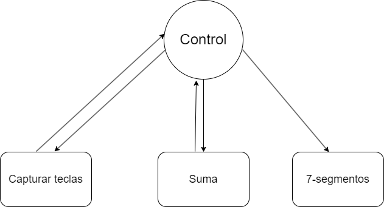

### 4.1 Descripción general de cada subsistema

#### Capturador de teclas

Para la creación del módulo capturador de teclas se diseñó el siguiente diagrama:

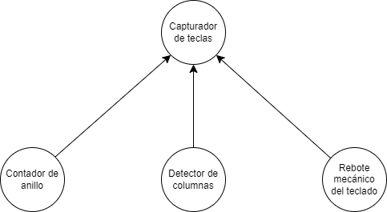

De esto se tiene que, se utiliza un contador de anillo para activar las filas secuencialmente con un clk, seguidamente se implementa una FSM para detectar columnas activas, y por último se desarrolla un antirrebote de la señal detectada de la columna encendida.

Con ello se desarrolló primeramente el módulo de contador de anillo, con ello se tienen las siguientes entradas y salidas del módulo:

- `input logic clk`: Señal de clock a 27 MHz.
- `input logic rst`: Señal de reset utilizada para iniciar el estado del contador de anillo.
- `output logic [3:0]fila`: Señal de salida de 4 bits, que representa la fila encendida, además de encender y apagar pines físicos de la FPGA.

A partir de las entradas, con el clock a 27 MHz, se inicia encendiendo la primera fila, con fila_encendida <= 4'b0001, para encender las otras filas se utiliza un shifter, fila_encendida <= {fila_encendida[2:0], fila_encendida[3]}, donde pasa a encender la siguiente fila cada nuevo ciclo del clock [3].

```SystemVerilog
module cont_anillo(
    input logic clk,
    input logic rst,
    output logic [3:0]fila
);
logic [3:0]fila_encendida;
    always_ff @(posedge clk)begin
        if (rst)begin
            fila_encendida <= 4'b0001;  
        end
        else begin
            fila_encendida <= {fila_encendida[2:0], fila_encendida[3]};
        end
    end
    assign fila = fila_encendida;
endmodule
```

En la siguiente imagen se observa el comportamiento de la activación de las filas.

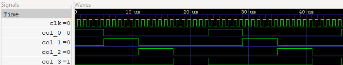


El segundo módulo que tratar es el detector de columna, en él se tienen las siguientes entradas y salidas:

- `input logic clk`: Señal de clock a 27 MHz.
- `input logic rst`: Señal de reset utilizada para iniciar el estado del contador de anillo.
- `input logic [3:0]fila`: Señal de entrada que corresponde a las filas activas del contador de anillo.
- `input logic col_0, col_1, col_2, col_3`: Señales de entrada provenientes de pines físicos de la FPGA.
- `output logic [3:0]tecla_pre`: Señal de 4 bits que representa el código binario de las teclas del teclado 4x4.
- `output logic suma`: Señal de salida que representa si se presionó la tecla A para realizar la suma.
- `output logic igual`: Señal de salida que representa si se presionó la tecla B para realizar la suma.


Para construir el módulo se desarrolló una FSM, para detectar si se presiona alguna configuración especifica de fila y columna, para ello se tiene un estado para cada fila, y además otros 16 estados más, que corresponden a cada una de las teclas presentes en el teclado 4x4.

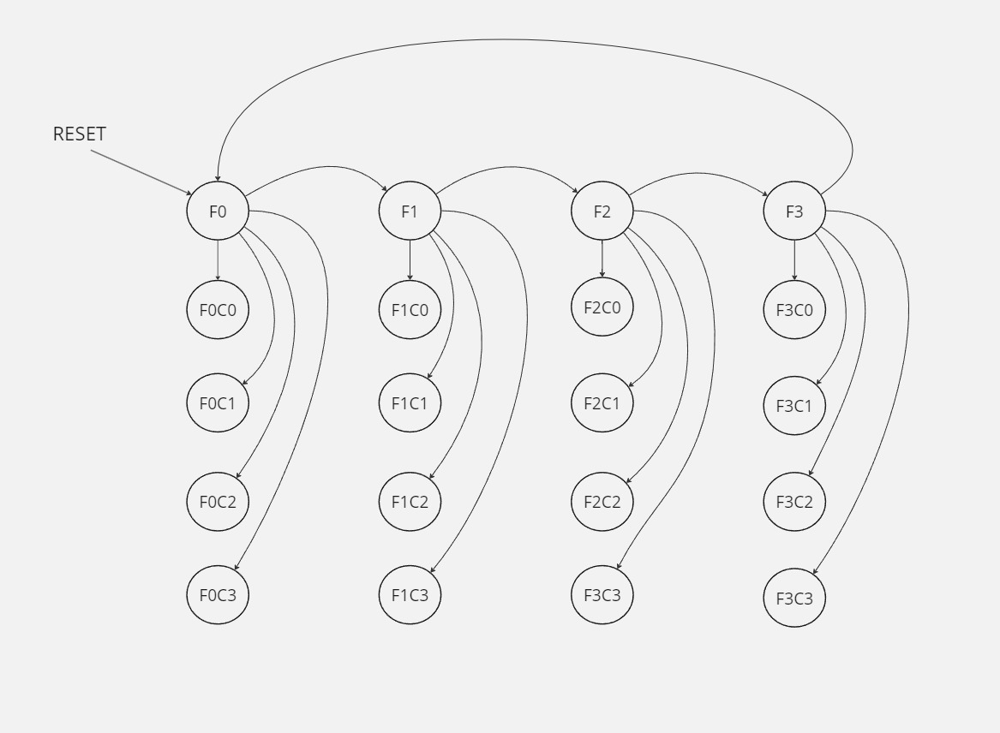

Del diagrama anterior se desarrolló el siguiente código:

```SystemVerilog
module detector_columna (
    .
    .
    .
);
    typedef enum logic [4:0] { 
        F0, F1 , F2, F3, 
        F0C0, F0C1, F0C2, F0C3,
        F1C0, F1C1, F1C2, F1C3,
        F2C0, F2C1, F2C2, F2C3,
        F3C0, F3C1, F3C2, F3C3
    } estado;

    estado estado_act, estado_sig;
    logic [3:0] salida;

    always_ff @(posedge clk)begin
        if (rst)begin
            estado_act <= F0;
        end 
        else begin
            estado_act <= estado_sig;
        end
    end

    always_comb begin
        estado_sig = estado_act;
        case(estado_act)
            F0: begin
                if(fila == 4'b0001) begin
                    if (col_0) estado_sig = F0C0; 
                    else if (col_1) estado_sig = F0C1;
                    else if (col_2) estado_sig = F0C2;
                    else if (col_3) estado_sig = F0C3;
                    else estado_sig = F1;
                end
                else begin 
                    estado_sig = F1;
                end
            end
            F1: begin
                if (fila == 4'b0010)begin
                    if (col_0) estado_sig = F1C0; 
                    else if (col_1) estado_sig = F1C1;
                    else if (col_2) estado_sig = F1C2;
                    else if (col_3) estado_sig = F1C3;
                    else estado_sig = F2;
                end
                else begin 
                    estado_sig = F2;
                end
            end
            F2: begin
                if(fila == 4'b0100) begin
                    if (col_0) estado_sig = F2C0;
                    else if (col_1) estado_sig = F2C1;
                    else if (col_2) estado_sig = F2C2;
                    else if (col_3) estado_sig = F2C3;
                    else estado_sig = F3;
                end
                else begin 
                    estado_sig = F3;
                end
            end
            F3: begin
                if (fila == 4'b1000)begin
                    if (col_0) estado_sig = F3C0;
                    else if (col_1) estado_sig = F3C1;
                    else if (col_2) estado_sig = F3C2;
                    else if (col_3) estado_sig = F3C3;
                    else estado_sig = F0;
                end
                else begin 
                    estado_sig = F0;
                end
            end
            default: estado_sig = F0;
        endcase     
    end 
```

Del código anterior se observa que primero se definen los estados de la FSM, con typedef enum logic [4:0]{..Estados..}, además se definen conexiones internas, como estado estado_act, estado_sig y logic [3:0] salida; seguidamente se define la logica secuencial para el estado actual con un always_ff además de estado_act <= F0 y estado_act <= estado_sig. En el bloque de always_comb se define toda la lógica combinacional relacionada con la FSM, donde se define primeramente el estado por defecto estado_sig = estado_act, y con la función case se analizan las filas, si están activas, por medio de un if o else if se pasa al estado siguiente, que corresponde a una tecla presionada, si no se presiona pasa a la siguiente fila y repite el procedimiento, también se define F0 como la fila por defecto como estado siguiente [1].


```SystemVerilog
module detector_columna (
    .
    .
);
    .
    .
    .
    always_ff @(posedge clk) begin 
        if (rst)begin 
            salida <= 4'b0000;
        end
        else begin
            case (estado_sig)
                F0C0: salida <= 4'b0000; //1
                F0C1: salida <= 4'b0001; //2
                F0C2: salida <= 4'b0010; //3
                F0C3: salida <= 4'b0011; //A
                F1C0: salida <= 4'b0100; //4
                F1C1: salida <= 4'b0101; //5
                F1C2: salida <= 4'b0110; //6
                F1C3: salida <= 4'b0111; //B
                F2C0: salida <= 4'b1000; //7
                F2C1: salida <= 4'b1001; //8
                F2C2: salida <= 4'b1010; //9
                F2C3: salida <= 4'b1011; //C
                F3C0: salida <= 4'b1100; //E
                F3C1: salida <= 4'b1101; //0
                F3C2: salida <= 4'b1110; //F
                F3C3: salida <= 4'b1111; //D
                default: salida <= 4'b0000;
            endcase
        end
    end
    
    //asigna la salida
    assign tecla_pre = salida;
    //se activa la suma
    assign suma= (tecla_pre == 4'b0011);
    //se activa el igual
    assign igual = (tecla_pre == 4'b0111);

endmodule
```
Continuando con el código de detector de columna por medio de lógica secuencial con always_ff se detecta el estado y al estado se le asigna un código binario, que corresponde a el número del teclado presionado desde el 0 hasta el 9 y las teclas de A hasta F, y con un assign se asignan los valores de salida que es una conexión interna a la salida tecla_pre [1].

Del Anexo 8.1, donde se observa el código del testbench para el módulo de detector de columna, donde por medio de la herramienta de GTKwave y la consola, se observa como la salida tecla_pre toma los valores de las teclas presionadas.

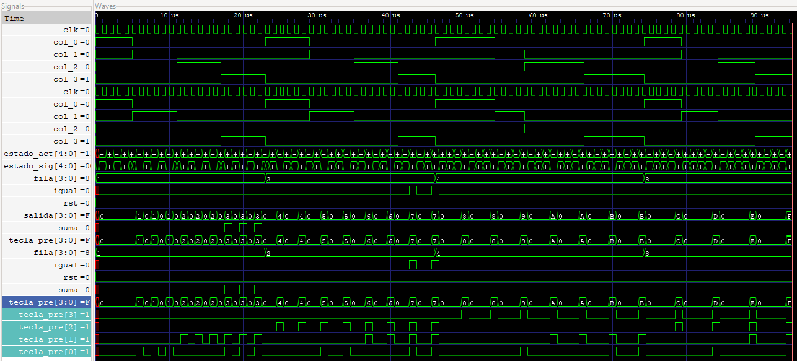

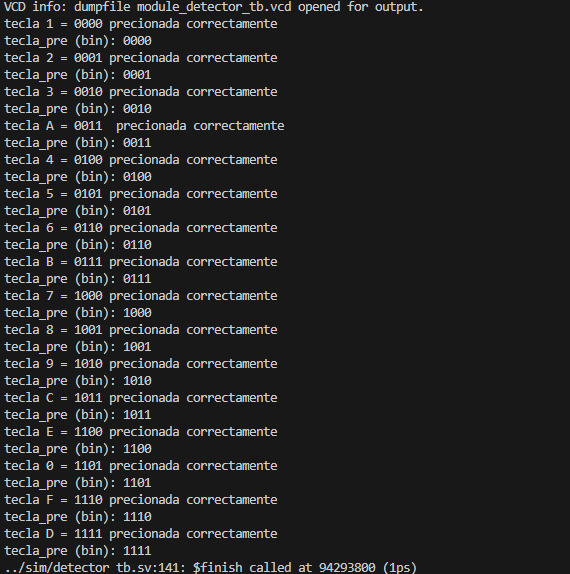


Para el último módulo sobre el rebote mecánico se necesita un divisor de frecuencia, donde se tiene el siguiente código basado en [5]:


```SystemVerilog
module divisor (
    input logic clk,
    output reg clk_div
);
    parameter frecuencia = 27000000; //27 Mhz
    parameter fre = 1000000; //1Mhz
    parameter max_cuenta = frecuencia / (2*fre); 
    reg [4:0]cuenta;
    initial begin 
        cuenta = 0;
        clk_div = 0;
    end
    always_ff @(posedge clk) begin 
        if (cuenta == max_cuenta) begin
            clk_div <= ~clk_div;
            cuenta <= 0;
        end
        else begin
            cuenta <= cuenta+1;
        end
    end
endmodule
```
En el código, se observa que tiene una entrada, que corresponde a el clock de 27 MHz y una salida de un divisor de frecuencia a 1 MHz, donde primeramente se definen los parámetros con los valores deseados para obtener un parámetro max_cuenta que son 13 ciclos del clock a 27 MHz, se define un reg [4:0] para contar los flancos del clock, se inicia cuenta y clk_div a 0, y con la lógica secuencial, cuando cuenta llega a los 13 ciclos contados se cambia a alto o bajo, logrando un clk_div a 1 MHz [5].

Del Anexo 8.2, se tiene el testbench del divisor de frecuencia, donde se observa en la siguiente imagen el funcionamiento del módulo.


Para el módulo del rebote mecánico del teclado se basó en [6]:

```SystemVerilog
module rebote(
    input logic clk,
    input logic boton,
    output logic boton_sal
); 
    logic clk_hab;
    logic q1, q2, q2_com, q0;
    divisor clk_ha( clk, clk_hab);
    FF_D_habilitador ff1(clk, clk_hab, boton, q0);
    FF_D_habilitador ff2(clk, clk_hab, q0, q1);
    FF_D_habilitador ff3(clk, clk_hab, q1, q2);
    assign q2_com = ~q2;
    assign boton_sal = q1 & q2_com;
endmodule
```

Se utilizan tres flip flops D, para la generación de un unico pulso en la salida de boton_sal, esto cumpliendo que boton_sal = q1 & q2_com, utilizando una compuerta AND [6].


Para el módulo FF_D_habilitador, realiza la acción de que el flip-flop D, se actualiza cuando el clk_hab esta en alto, este código se basó en [6].

```SystemVerilog
module FF_D_habilitador(
    input logic clk, 
    input logic clk_hab,
    input logic D, 
    output reg Q=0
);
    always_ff @ (posedge clk) begin
        if(clk_hab == 1) 
            Q <= D;
    end
endmodule
```

En el Anexo 8.3 se puede observar el testbench del modulo del rebote mecánico, donde se puede observar su funcionamiento en la siguiente imagen.

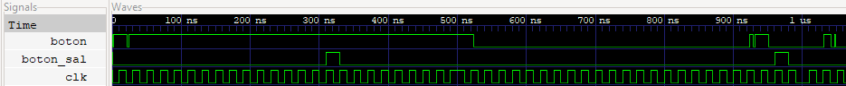


Se realizó el módulo capturador de teclas, donde se instancian todos los módulos anteriores, obteniendo un solo bloque para manipular el subsistema de capturar las teclas.

```SystemVerilog
module capturador_de_teclas(
    input logic clk,
    input logic rst,
    input logic col_0, 
    input logic col_1, 
    input logic col_2, 
    input logic col_3,
 
    output logic [3:0]tecla_pre, 
    output logic suma,     
    output logic igual
);
    logic [3:0]fila_ent;
    logic clk_div;
    logic col_00;
    logic col_11;
    logic col_22;
    logic col_33;
    cont_anillo cont_ani_inst(
        .clk(clk),
        .rst(rst),
        .fila(fila_ent)
    );
    rebote rebote_ins0(
        .clk(clk),
        .boton(col_0),
        .boton_sal(col_00)
    );
        rebote rebote_ins1(
        .clk(clk),
        .boton(col_1),
        .boton_sal(col_11)
    );
        rebote rebote_ins2(
        .clk(clk),
        .boton(col_2),
        .boton_sal(col_22)
    );
        rebote rebote_ins3(
        .clk(clk),
        .boton(col_3),
        .boton_sal(col_33)
    );
    detector_columna detector_col_inst(
        .clk(clk),
        .rst(rst),
        .fila(fila_ent),
        .col_0(col_00),
        .col_1(col_11),
        .col_2(col_22),
        .col_3(col_33),
        .tecla_pre(tecla_pre),
        .suma(suma),
        .igual(igual)
    );
    divisor divisor_inst(
        .clk(clk),
        .clk_div(clk_div)
    );
endmodule
```
En el Anexo 8.4 se puede observar el testbench de módulo capturador de teclas, en las siguientes imágenes se observa cómo se detecta el pulso de botón de salida pasando por el módulo de rebote y como se detecta la tecla presionada.

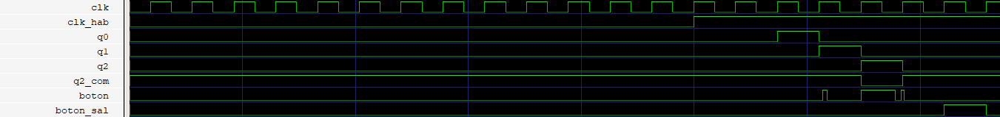

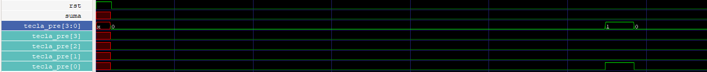

Para el análisis de consumo de recursos en la FPGA y del consumo de potencia que reportan las herramientas, los siguientes valores generados con el make synth y make pnr.

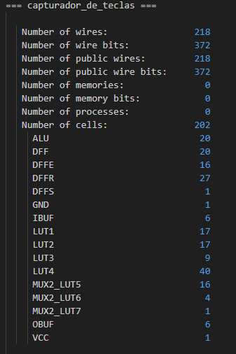

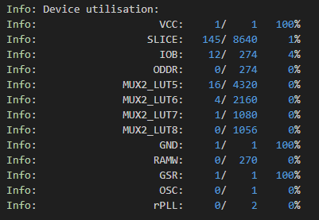

De esto, se destacan el consumo de recursos lógicos en la FPGA, como lo son los look-up-tables (LUTs), estos corresponde a el tamaño de tablas de búsqueda utilizadas, donde se implementa el sistema de capturar las teclas, se destacan 17 LUT 1, que utiliza una entrada y funciones simples, 17 LUT 2, que utiliza dos entradas y funciones AND, OR, XOR, 9 LUT 3, con tres entradas y 40 LUT 4 con cuatro entradas para realizar funciones más complejas, además se tienen los Wires, que se utilizan 218, que corresponden a conexiones internas que ocupan 372 bits, y 20 ALU que corresponden a unidades aritméticas lógicas para realizar operaciones lógicas o matemáticas, además se utilizaron flip-flops D, para almacenar estados, como también la utilización de varios multiplexores.

Además se observa la utilización de una fuente de alimentación VCC, 145  SLICE (unidades de lógica configurables) que contienen LUTs y flip-flops para la implementación de funciones lógicas y secuenciales, 12 IOB (bloques de entrada y salida) y 1 GSR (global set/reset).


#### Almacenamiento de datos
Para el modulo de alamacenamientos de datos primero se definieron las siguientes variables:
##### Entradas 
- `input logic clk`: Señal del clock a 27 MHz
- `input logic rst`: Señal del reset para iniciar y vaciar los vectores de almacenamiento de datos
- `input logic [3:0] tecla_pre`: La señal mencionada nateriormente de la tecla que fue selecionada
- `input logic cargar_numero1`: Señal de control que indica cuándo cargar un número en  `numero1`.
- `input logic cargar_numero1`: Señal de control que indica cuándo cargar un número en `numero2`.
- `input logic reset_datos`: Señal de control interna que reinicia los valores de `numero1` y `numero2`, y los índices internos de los números.
##### Salidas
- `output logic [11:0] numero1`: Registro de 12 bits que almacena el primer número capturado.
- `output logic [11:0] numero2`: Registro de 12 bits que almacena el segundo número capturado.
##### Señales internas 
`logic [1:0] indice_numero1` y `output logic [11:0] numero2`: Variables internas de 2 bits que actúan como índices para saber en qué parte del número (de 12 bits) se debe almacenar el próximo dígito ingresado.

```SystemVerilog
module almacenamiento_datos (
    input logic clk,
    input logic rst,
    input logic [3:0] tecla_pre,   
    input logic cargar_numero1,    
    input logic cargar_numero1,    
    input logic reset_datos,       
    output logic [11:0] numero1,  
    output logic [11:0] numero2
);
    logic [1:0] indice_numero1; 
    logic [1:0] indice_numero2; 
```
Acontinuación, se va a expliacar el funcionamiento del modulo. 
- Se inicia con el con el rst ya que se asegura que tanto el `numero1`, `numero2`, `indice_numero1` e `indice_numero2`empiecen en 0. 
- Se implementa la señal interna de `reset_datos` la cual al activarse vualve a reiniciar el sistema dejando a los numeros y los indices en ceros.
- En el caso de activarse el `cargar_numero1` el modulo lee la señal `tecla_pre` y deacuerdo a la posicion del `indice_numero1` almacena el dato en la posicion `numero1` despues se incrememta en una posicion y cuando llega al limite se devuelve a 0.
- En el caso de activarse el `cargar_numero1` sucese la misma logica solo que se trabaja con el `numero2` y el `indice_numero`

```SystemVerilog
  always_ff @(posedge clk or posedge rst) begin
        if (rst) begin
            // Inicializa los valores
            indice_numero1 <= 0;
            indice_numero2 <= 0;
            numero1 <= 12'b0;
            numero2 <= 12'b0;
        end else begin
            if (reset_datos) begin
                numero1 <= 12'b0;
                numero2 <= 12'b0;
                indice_numero1 <= 0;
                indice_numero2 <= 0;
            end else begin
                if (cargar_numero1) begin
                    case (indice_numero1)
                        2'b00: numero1[3:0]   <= tecla_pre;
                        2'b01: numero1[7:4]   <= tecla_pre;
                        2'b10: numero1[11:8]  <= tecla_pre;
                        default: ; 
                    endcase

                    if (indice_numero1 < 2'b10) begin
                        indice_numero1 <= indice_numero1 + 1;
                    end else begin
                        indice_numero1 <= 0; // Reinicia si se supera el límite
                    end
                end else if (cargar_numero2) begin
                    case (indice_numero2)
                        2'b00: numero2[3:0]   <= tecla_pre;
                        2'b01: numero2[7:4]   <= tecla_pre;
                        2'b10: numero2[11:8]  <= tecla_pre;
                        default: ; // Agregar un caso por defecto para manejar índices no válidos
                    endcase
                    // Incrementar índice y reiniciar si es necesario
                    if (indice_numero2 < 2'b10) begin
                        indice_numero2 <= indice_numero2 + 1;
                    end else begin
                        indice_numero2 <= 0; // Reinicia si se supera el límite
                    end
                end 
            end
        end
    end
```
En el anexo 8.5, se puede observar los casos que se le ingresaron para poder observar el funcionamiento del `module_almacenamiento`, el cual se le dio un ejemplo de algunas teclas que podian ser ingresadas y se muestra como se va guardando en el orde que corresponde, así se puede ver en la imagen del GTKwave.

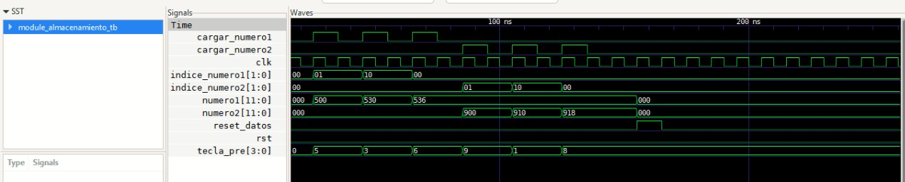

En las dos suiguientes imagenes se muestra el consumo de recursos por parte de la FPGA y el consumo de potencia que reportan las herramientas gnerados por el make synth y make pnr

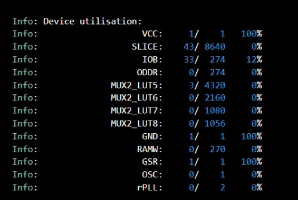

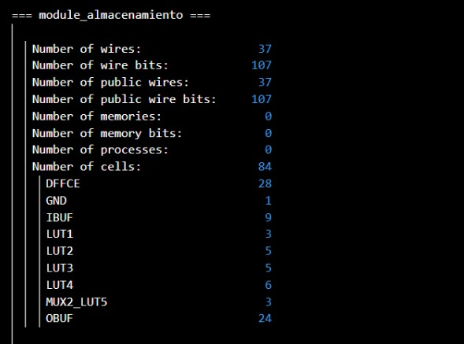

Como se puede observar en la imagen para el make pnr la utilizacion de recursos es baja, donde la mayoria de los recursos son slices, LUTs, IOBs ya que el modulo no tiene una gran complejidad, sin embrago esuna ventja ya que le queda una gran cantidad de recursos disponibles.
Al igual que el make pnr,  el make synth es ligero ya que no cuenta con una gran complejidad, sin ambrago se puede destacar la grancantidad de datos que se estan tranportando por los cables, así como las conexiones que se tiene al exterior. Además se implemento algunos elemetos basicos como DFFCE los cuales son los registros basados en flip-flops, IBUF para manejar las señales de entrada, los Lookup Tables (LUTs) como LUT1 (3), LUT2 (5), LUT3 (5), LUT4 (6), MUX2_LUT5 (3), que pfueron implementados para las funciones buleanas en la FPGA, OBUF para manejar la señales de salida y el GNG para la señal de tierra.

Al estar trabajando con bajo consumo de recursos de puede decir que el modulo es eficiente y cuanta con la capacidad de seguir desarrollandolo aún más, sin llegar a sobre cargar la FPGA.


#### Display
En el modulo del display se van a definir las siguientes variables de entradas y salidas basandose en este codigo []:

##### Entradas
- `input logic clk`: Señal del clock a 27 MHz.
- `input logic rst`: Señal del reset para iniciar.
- `input logic a`: Entrada para seleccionar cargar numero1
- `input logic b`: Entrada para seleccionar cargar numero2
- `input logic [11:0] numero1`: El numero 1 de 3 digitos en formato hexadecimal
- `input logic [11:0] numero2`: El numero 2 de 3 digitos en formato hexadecimal

##### Salidas
- `output logic [3:0] an`: Control para los ánodos de los displays
- `output logic [6:0] seg`: Controla que segmentos del display se enciende

##### Declaración de constantes
- `localparam N = 18`: Se usa para dimensionar el contador que gobierna el refresco de los displays segun la fromula que se utilizo en este codigo [].

#####  Declaraciones de señales internas
- `logic [N-1:0] q_reg`: Guarda el valor actual del contador
- `logic [N-1:0] q_next`: Es el valor siguiente (q_reg + 1).
- `logic [3:0] numero1_in`: Señal para almacenar el numero 1.
- ` logic [3:0] numero2_in`:Señal para almacenar el numero 2.
- `logic [3:0] numero_actual_in`: Para saber cual de los dos numeros se va a almacenar.
- `logic state`: Estado de la máquina que selecciona entre `numero1` y `numero2`.

##### Definicion de estado
- `localparam cargar_numero1 = 1'b0`: Estado en el que se carga y muestra `numero1``.
- ` localparam cargar_numero2 = 1'b1`: Estado en el que se carga y muestra `numero`.

```SystemVerilog
module module_display(
   input logic rst,
   input logic clk,
   input logic a,   
   input logic b,   
   input logic [11:0] numero1,  
   input logic [11:0] numero2,  
   output logic [3:0] an,       
   output logic [6:0] seg       
);

    // Declaración de constantes
    localparam N = 18; 

    // Declaraciones de señales internas
    logic [N-1:0] q_reg;
    logic [N-1:0] q_next;
    logic [3:0] numero1_in;
    logic [3:0] numero2_in;
    logic [3:0] numero_actual_in;
    logic state;  // Señal para el estado (selección entre número1 y número2)

    // Definición de estados
    localparam cargar_numero1 = 1'b0;
    localparam cargar_numero2 = 1'b1;
```
Acontinuacion se va a explicar el funcionamiento del modulo del display para 4 digitos:
- Primero esta el contador de refreco que va ir cambiando entre los digitos del los numeros del display. Donde el `q-reg` se incremeta con cada falco positivo del reloj `clk` y se reinicia a 0 si se activa el `rst`, para alternar ente los digitos.
- en la `always_comb` se controla cual numero fue selecionado si `numero1` o `numero2` y cual digito en especifico se debe mostar.
- Por ultimo en la seccion `always_comb` se decodifica el valor de `numero_actual_in` para mostralo en el display de 7 segmentos.
```SystemVerilog

    // Contador de refresco para cambiar entre dígitos de los números
    always_ff @(posedge clk or posedge rst) begin 
        if (rst)
            q_reg <= 0;
        else 
            q_reg <= q_next;
    end 

    assign q_next = q_reg + 1;

    // Asignar valores por defecto para evitar latches
    always_comb begin
        state = cargar_numero1;  
        an = 4'b1111;           
        numero_actual_in = 4'b0000;  

        if (a) begin
            state = cargar_numero1;  
        end else if (b) begin
            state = cargar_numero2;  
        end

        case (q_reg[N-1:N-2])
            2'b00: begin 
                an = 4'b1110;  // Habilita el primer display
                if (state == cargar_numero1)
                    numero_actual_in = numero1[3:0];  
                else
                    numero_actual_in = numero2[3:0];  
            end 
            2'b01: begin
                an = 4'b1101;  // Habilita el segundo display
                if (state == cargar_numero1)
                    numero_actual_in = numero1[7:4];  
                else
                    numero_actual_in = numero2[7:4]; 
            end 
            2'b10: begin 
                an = 4'b1011;  // Habilita el tercer display
                if (state == cargar_numero1)
                    numero_actual_in = numero1[11:8];  
                else
                    numero_actual_in = numero2[11:8];  
            end 
            default: begin 
                an = 4'b1111;  
                numero_actual_in = 4'b0000;  
            end 
        endcase      
    end 

    // Lógica para decodificar el número en segmentos de 7 segmentos
    always_comb begin
        seg = 7'b1111111; 

        case (numero_actual_in)
            4'h0: seg = 7'b1000000; // Muestra 0
            4'h1: seg = 7'b1111001; // Muestra 1
            4'h2: seg = 7'b0100100; // Muestra 2
            4'h3: seg = 7'b0110000; // Muestra 3
            4'h4: seg = 7'b0011001; // Muestra 4
            4'h5: seg = 7'b0010010; // Muestra 5
            4'h6: seg = 7'b0000010; // Muestra 6
            4'h7: seg = 7'b1111000; // Muestra 7
            4'h8: seg = 7'b0000000; // Muestra 8
            4'h9: seg = 7'b0010000; // Muestra 9
            default: seg = 7'b1111111; // Apagado
        endcase
    end

endmodule

```
En el anexo 8.6, se puede observar los casos que se le ingresaron para poder ver el funcionamiento del `module_display`, el cual se le dio un ejemplo de dos numeros que fueron ingresados para poder corroborar que efectivamente presentaba los numeros en el display de 7 segmentos, así se puede ver en la imagen del GTKwave.

Ademas de su funcionamiento con el comando make wv, también se puede implementar el make synth y make pnr para poder hacer su analisis de cuanto consumo de recursos genera este modulo y como se puede apresiar el la siguiente imagen:
En el caso del make synth se puede observa una implamentacion significativa de recurso ya que utilizan bastantes cables al igual de la cantidad de conexiones que esta realizando al exterior, tiene un numero elevado de uso de las celdas y incluye componnetes como ALUs, flip-flops, buffers de entrada y salida y LUTs, dejando claro que esta module es mucho más complejo dado que tiene que hacer multiples operacioneslogicas. 

Un caso siminlar pasa a la hora de analaisar el make pnr ya que estos dos van de la mano y se muestra que recursos como VCC, GND y GSR esta siendo utilizados el 100%, siembargo existen otros como Slice, IOB y algunas LUTs que muestran una baja utilizacion dando la opornutidad para agregarle ateras adicionales o buscar obtimizaciones.

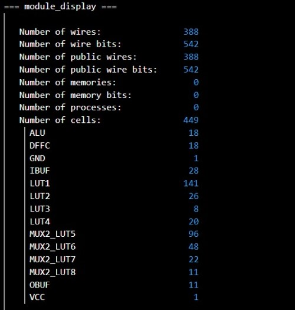

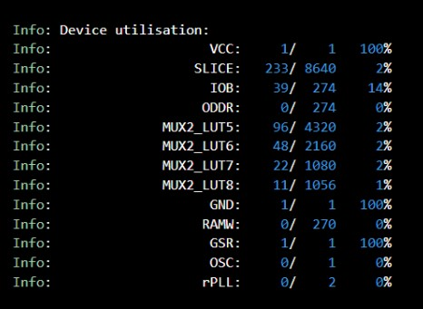


#### Sumatoria

El módulo SumaAri está diseñado para realizar la suma aritmética de dos números binarios de 12 bits cada uno, que representan valores decimales de hasta 3 dígitos (máximo 999). La salida de la suma es un valor de 14 bits que puede representar hasta 4 dígitos decimales (máximo 1998).

El módulo SumaAri contiene las siguientes señales:

- `clk`: Señal de reloj utilizada para la sincronización del proceso de suma.
- `rst_n`: Señal de reset activa baja, que inicializa la salida a cero.
- `num1 y num2`: Entradas de 12 bits que representan los dos números a sumar.
- `sum`: Salida de 14 bits que contiene el resultado de la suma de num1 y num2.

El módulo opera bajo un proceso secuencial, activado por el flanco de subida de la señal de reloj (clk) o el flanco de bajada del reset (rst_n). Cuando la señal rst_n está activa (en 0), la salida sum se inicializa a 0. Cuando rst_n está en 1, el módulo realiza la operación de suma entre num1 y num2, almacenando el resultado en la señal sum.

El bloque always_ff asegura que la suma se realiza de manera síncrona con la señal de reloj, permitiendo que la operación se realice de manera controlada en cada ciclo de reloj.


```SystemVerilog
module SumaAri (
    input logic clk,           // Señal de reloj
    input logic rst_n,         // Señal de reset activa baja
    input logic [11:0] num1,   // Primer número de entrada (3 dígitos decimales)
    input logic [11:0] num2,   // Segundo número de entrada (3 dígitos decimales)
    output logic [13:0] sum    // Resultado de la suma (máximo 4 dígitos decimales)
);

    always_ff @(posedge clk or negedge rst_n) begin
        if (!rst_n) begin
            sum <= 14'd0; // Resetear el resultado de la suma
        end else begin
            sum <= num1 + num2; // Realizar la suma aritmética
        end
    end
endmodule
```

En el Anexo 8.8 se puede observar el testbench del módulo de SumaAri.

La señal de reloj (clk) se genera mediante un proceso initial, con un período de 10 ns. Esto se logra con una instrucción forever, que alterna el valor de clk cada 5 ns para obtener un ciclo de 10 ns.

En el testbench se definen diferentes etapas de la simulación:

Estimulación:

Se realizan dos pruebas de suma:
1. Primero, num1 se asigna a 123 (12'b1111011) y num2 a 456 (12'b111001000).
2. Luego, num1 se asigna a 789 (12'b1100010101) y num2 a 321 (12'b101000001).


Monitorización y generación de Archivo de señales:
El testbench utiliza $monitor para imprimir los valores de num1, num2, y sum en cada cambio de señal. Además, se generan archivos de volcado (vcd) para analizar las señales con un visualizador de formas de onda.

Resultados de simulación: 
El testbench se utiliza para verificar la funcionalidad del módulo SumaAri mediante la observación de los resultados de la suma de diferentes pares de números (num1 y num2). La simulación demuestra que el módulo realiza la suma correctamente, y los resultados se pueden visualizar en el archivo de forma de onda generado (SumaAri.vcd).


#### Control (maquina de estado)
En este modulo como se esta trabajando con una maquina de estado acontinuacion se va a presentar el diagrama con el cual se esta implementando la logica del programa:

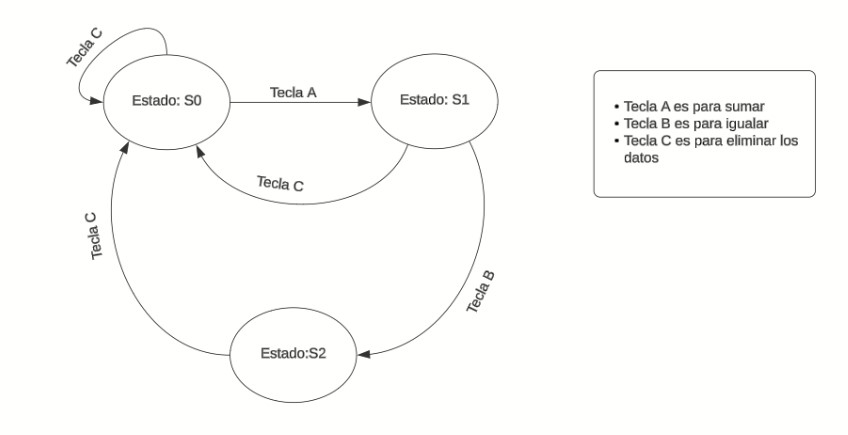

##### Entradas
- `input logic clk`: Señal del clock a 27 MHz.
- `input logic rst`: Señal del reset para iniciar.
- `input logic a`: Tecla para sumar
- `input logic b`: Tecla para igualar los datos
- `input logic c`: Tecla para eliminar datso
- `input logic [3:0] tecla_pre`: La lectura de las teclas de modulo de captura de teclas
##### Salidas
- `output logic cargar_numero1`: Señal que indica cuándo cargar el primer número.
- `output logic cargar_numero2`: Señal que indica cuándo cargar el segundo número.
- `output logic rst_datos`: Señal para eliminar datos
- `output logic igual`: descripción de la salida


```SystemVerilog

module maquina_estado (
    input logic clk,
    input logic rst,
    input logic a,  
    input logic b,   
    input logic c,   
    input logic [3:0] tecla_pre,
    output logic cargar_numero1,  
    output logic cargar_numero2,  
    output logic rst_datos,     
    output logic igual,           
    output logic clk_out
);
```
Continuando con la idea que se presento en el diagrama para la maquina de estado la logica es la siguiente:
- Se tienen 3 estado posibles definidos por `typedef enum`, los cuales son S0, S1, S2.
- La FSM lmacena su estado actual en el regitros `state` y se actualiza cada ciclo de reloj o se reinicia cuando `rst` esta activada y vualve al estado inicial S0 o sino cambi al `nexstate`.
Con el `always_com` se hace la logica del cambio de estado de acuedo con las entradas a, b, c y el estado actual, entonces de acuerdo a la entrada se decide cual va a ser el proximo `nexstate` y cuales señales deben activarse.Para guiarse se tomo como ejemolo un ejercico del libro[].
```SystemVerilog
    // Definición de estados
    typedef enum logic [1:0] {S0, S1, S2} statetype;
    statetype state, nextstate;

    // Registro de estado
    always_ff @(posedge clk or posedge rst) begin
        if (rst) begin
            state <= S0;
        end else begin
            state <= nextstate;
        end
    end

    // Lógica de cambio de estado
    always_comb begin
        nextstate = state; 
        cargar_numero1 = 0;
        cargar_numero2 = 0;
        reset_datos = 0;
        igual = 0;

        case (state)
            S0: begin
                if (a) begin
                    cargar_numero1 = 1; 
                    nextstate = S1;
                end else if (c) begin
                    reset_datos = 1; 
                end
            end
            S1: begin
                if (a) begin
                    cargar_numero2 = 1; 
                    nextstate = S2;
                end else if (c) begin
                    reset_datos = 1; 
                    nextstate = S0;
                end
            end
            S2: begin
                igual = 1; // Señal de igual cuando se llega al estado S2
                if (c) begin
                    reset_datos = 1; // Reiniciar datos cuando se presiona 'c'
                    nextstate = S0;
                end
            end
        endcase
    end

endmodule
```

En el anexo 8.7, se puede observar los casos que se le ingresaron para poder ver el funcionamiento del `module_maquina_estado`, donde se probo cada tecla para ver si cumplia su funcionaminto al pasar al siguiente estado segmentos, así se puede ver en la imagen del GTKwave.

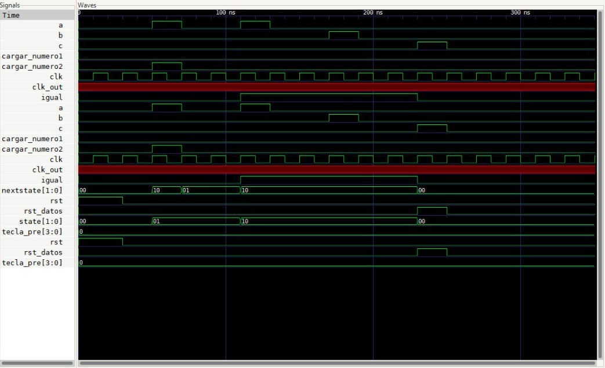

Además tambien se provaron el make synth y el make pnr que adecuerdo a los datos sintetizados se puede decir que la maquina de estado es un programa simple ya que no consume gran cantidad de recursos, algunas de ellos son  DFFs, buffers de entradas y salidas y varias LUTs en el caso de make synth y con el make pnr utiliza VCC, GDN y GSR llegando a utilizarlos al 100% sin ambargo existen otros que tienen una baja implementacion como SLICE, IOB y varios LUTs o otros que nos los utiliza del todo como ODDR, RAMW y OSC.

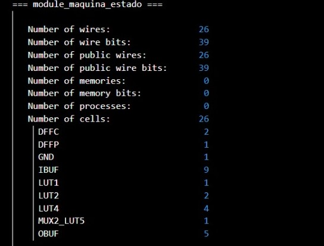

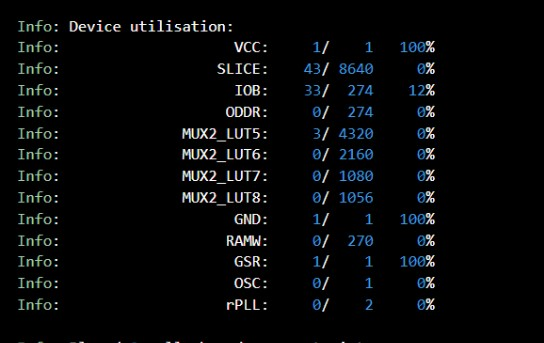


## 5. Conclusiones

El desarrollo del sistema digital sincrónico para la realización de sumas aritméticas, demostró la efectividad de cada módulo por separado en SystemVerilo, en donde se manejaron los datos de manera eficiente y sincronizada. El sistema desarrollado no solo cumple con los objetivos planteados por separado, sino que también se debe destacar una importante comunicación para el desarrollode cada parte del sistema.Las pruebas y validaciones realizadas de cada módulo muestran que el sistema puede ser una base al desarrollo correcto de una calculadora que desarrolla sumatorias en un HDL.


## 6. Análisis de principales problemas 

- El principal problema que se presentó fue el mal desarrollo de un sistema de control, con el cuál no se logró implementar la unión de todos los módulos desarrollados.

- Se presentaron varios errores de sintaxis en diferentes módulos.

- En el módulo de almacenamiento no se almacenan correctamente varios valores por lo cuál quedan al "aire".

- No se implemento una buena lectura de los números detectados por el módulo de detector de teclas.

- El módulo de display presenta varios problemas con latches.


## 7. Referencias
[0] David Harris y Sarah Harris. *Digital Design and Computer Architecture. RISC-V Edition.* Morgan Kaufmann, 2022. ISBN: 978-0-12-820064-3

[1] R. Gorla and R. Gorla, “Finite state machines in Verilog,” VLSI WEB, Apr. 12, 2024. https://vlsiweb.com/finite-state-machines-in-verilog/

[2] “AMD Technical Information Portal.” https://docs.amd.com/r/en-US/ug901-vivado-synthesis/FSM-Example-Verilog

[3] Luis Vargas. “Ejemplos verilog.” https://www.todopic.com.ar/foros/index.php?topic=32327.msg272414#msg272414

[4] S. P. Lung, “Divisor de Reloj en Verilog.” https://idielectronica.blogspot.com/2014/06/verilog-divisor-de-reloj.html

[5] Oscar Martínez. Tutorías con Ingenio Universidad Nacional, “Divisor de frecuencia en Verilog,” YouTube. Oct. 29, 2016. [Online]. Available: https://www.youtube.com/watch?v=sLz8vAvoils

[6] “Verilog code for debouncing buttons on FPGA,” FPGA4student.com. https://www.fpga4student.com/2017/04/simple-debouncing-verilog-code-for.html


## 8. Anexos

### 8.1 Testbench detector de columnas

```SystemVerilog
module detector_tb;
    logic clk;
    logic rst;
    logic [3:0] fila;
    logic col_0, col_1, col_2, col_3;
    logic [3:0] tecla_pre;
    logic suma;
    logic igual;
    detector_columna detector_columna_tb(
        .clk(clk),
        .rst(rst),
        .fila(fila),
        .col_0(col_0),
        .col_1(col_1),
        .col_2(col_2),
        .col_3(col_3),
        .tecla_pre(tecla_pre),
        .suma(suma),
        .igual(igual)
    );
    always #500 clk = ~clk;
    initial begin
        clk = 0;
        rst = 1;
        fila = 4'b0000;
        col_0 = 0; col_1 = 0; col_2 = 0; col_3 = 0;
        #10 rst = 0;
        //F0
        //1
        fila = 4'b0001; col_0 = 1; col_1 = 0; col_2 = 0; col_3 = 0; #5000;
        if (tecla_pre == 4'b0000) $display("tecla 1 = 0000 precionada correctamente");
        $display("tecla_pre (bin): %b", tecla_pre);
        //2
        #10;
        fila = 4'b0001; col_0 = 0; col_1 = 1; #5000;
        if (tecla_pre == 4'b0001) $display("tecla 2 = 0001 precionada correctamente");
        $display("tecla_pre (bin): %b", tecla_pre);
        //3
        #1000;
        fila = 4'b0001; col_1 = 0; col_2 = 1; #5000;
        if (tecla_pre == 4'b0010) $display("tecla 3 = 0010 precionada correctamente");
        $display("tecla_pre (bin): %b", tecla_pre);
        //A
        #1000;
        fila = 4'b0001; col_2 = 0; col_3 = 1; #5000;
        if (tecla_pre == 4'b0011) $display("tecla A = 0011  precionada correctamente");
        $display("tecla_pre (bin): %b", tecla_pre);
        //F1
        //4
        #1000;
        fila = 4'b0010; col_0 = 1; col_1 = 0; col_2 = 0; col_3 = 0; #5000;
        if (tecla_pre == 4'b0100) $display("tecla 4 = 0100 precionada correctamente");
        $display("tecla_pre (bin): %b", tecla_pre);
        //5
        #1000;
        fila = 4'b0010; col_0 = 0; col_1 = 1; #5000;
        if (tecla_pre == 4'b0101) $display("tecla 5 = 0101 precionada correctamente");
        $display("tecla_pre (bin): %b", tecla_pre);
        //6
        #1000;
        fila = 4'b0010; col_1 = 0; col_2 = 1; #5000;
        if (tecla_pre == 4'b0110) $display("tecla 6 = 0110 precionada correctamente");
        $display("tecla_pre (bin): %b", tecla_pre);
        //B
        #1000;
        fila = 4'b0010; col_2 = 0; col_3 = 1; #5000;
        if (tecla_pre == 4'b0111) $display("tecla B = 0111 precionada correctamente");
        $display("tecla_pre (bin): %b", tecla_pre);
        //F2
        //7
        #10;
        fila = 4'b0100; col_0 = 1; col_1 = 0; col_2 = 0; col_3 = 0; #8000;
        if (tecla_pre == 4'b1000) $display("tecla 7 = 1000 precionada correctamente");
        $display("tecla_pre (bin): %b", tecla_pre);
        //8
        #50;
        fila = 4'b0100; col_0 = 0; col_1 = 1; #4000;
        if (tecla_pre == 4'b1001) $display("tecla 8 = 1001 precionada correctamente");
        $display("tecla_pre (bin): %b", tecla_pre);
        //9
        #50;
        fila = 4'b0100; col_1 = 0; col_2 = 1;  #8000;
        if (tecla_pre == 4'b1010) $display("tecla 9 = 1010 precionada correctamente");
        $display("tecla_pre (bin): %b", tecla_pre);
        //C
        #50;
        fila = 4'b0100; col_2 = 0; col_3 = 1; #8000;
        if (tecla_pre == 4'b1011) $display("tecla C = 1011 precionada correctamente");
        $display("tecla_pre (bin): %b", tecla_pre);
        //F3
        //E
        #100;
        fila = 4'b1000; col_0 = 1; col_1 = 0; col_2 = 0; col_3 = 0; #5000;
        if (tecla_pre == 4'b1100) $display("tecla E = 1100 precionada correctamente");
        $display("tecla_pre (bin): %b", tecla_pre);
        //0
        #4.9;
        fila = 4'b1000; col_0 = 0; col_1 = 1;  #5000;
        if (tecla_pre == 4'b1101) $display("tecla 0 = 1101 precionada correctamente");
        $display("tecla_pre (bin): %b", tecla_pre);
        //F
        #4.9;
        fila = 4'b1000; col_1 = 0; col_2 = 1; #5000;
        if (tecla_pre == 4'b1110) $display("tecla F = 1110 precionada correctamente");
        $display("tecla_pre (bin): %b", tecla_pre);
        //D
        #4;
        fila = 4'b1000; col_2 = 0; col_3 = 1; #5000;
        if (tecla_pre == 4'b1111) $display("tecla D = 1111 precionada correctamente");
        $display("tecla_pre (bin): %b", tecla_pre);
        $finish;
    end
    initial begin // Para el diagrama de tiempos
        $dumpfile("module_detector_tb.vcd");
        $dumpvars(0, detector_tb); // Nombre correcto del testbench
    end
endmodule
```

Se realizó el anterior testbench, donde se le asignan los valores de las columnas encendidas o apagadas, con las columnas activas para detectar y generar los pulsos para la salida de tecla_pre, con ello en tecla_pre se genera el código binario correspondiente a la tecla presionada. Se utiliza un if para asegurar de que la salida toma el dato de los 4 bits.


### 8.2 Testbench divisor de frecuencia


```SystemVerilog
`timescale 1ns/1ps

module divisor_tb;
    logic clk;
    logic clk_div;
    divisor divisor_tbb(
        .clk(clk),
        .clk_div(clk_div)
    );
    initial begin   
        clk = 0;
        forever begin
            #18.52 clk = ~clk;
        end
    end
    initial begin  
        $monitor("Tiempo: %0t | clk = %b | clk_div = %b", $time, clk, clk_div);
        // Para el diagrama de tiempos
        $dumpfile("module_divisor_tb.vcd");
        $dumpvars(0, divisor_tb); // Nombre correcto del testbench
        #10000 $finish;
    end
endmodule
```
Se tiene el testbench del divisor de frecuencia, donde el clock se asigna a 1 MHz con #18.5 clk = ~clk, y se monitorean, el tiempo, el clk y el clk_div.


### 8.3 Testbench rebote mecánico de teclado

```SystemVerilog
module rebote_tb;
    reg boton;
    reg clk;
    logic boton_sal;
    rebote rebote_tbb(
        .boton(boton),
        .clk(clk),
        .boton_sal(boton_sal)
    );
    always #500 clk = ~clk; // Reloj de (27 MHz)
    initial begin
        clk = 0;
        forever begin
            #10 clk = ~clk;
        end
    end
    initial begin
        boton = 0;
        #2;
        boton = 1;
        #20;
        boton = 0;
        #2;
        boton = 1;
        #50;
        boton = 0;
        #400;
        boton = 1;
        #5;
        boton = 0;
        #2;
        boton = 1;
        #20;
        boton = 0;
        #80;
        boton = 1;
        #10;
        boton = 0;
        #5;
        boton = 1;
        #2;
        boton = 0;
        #100;
        boton = 1;
        $finish;
    end
    initial begin // Para el diagrama de tiempos
        $dumpfile("module_rebote_tb.vcd");
        $dumpvars(0, rebote_tb); // Nombre correcto del testbench
    end
endmodule
```


Para este testbench se trata de generar pulsos con ruido antes y después de un pulso de mayor duración.


### 8.4 Testbench capturador de teclas

```SystemVerilog
module capturador_de_teclas_tb;

    logic clk;
    logic rst;
    logic col_0;
    logic col_1;
    logic col_2;
    logic col_3;

    logic [3:0] tecla_pre;
    logic suma;
    logic igual;

    capturador_de_teclas capturador_de_teclas_tbb(
        .clk(clk),
        .rst(rst),
        .col_0(col_0),
        .col_1(col_1),
        .col_2(col_2),
        .col_3(col_3),
        .tecla_pre(tecla_pre),
        .suma(suma),
        .igual(igual)
    );
    initial begin
        clk = 0;
        forever #18.5 clk = ~clk;
    end

    initial begin

        rst = 1;
        col_0 = 0;
        col_1 = 0;
        col_2 = 0;
        col_3 = 0;

        #20;
        rst = 0;

        #30 col_0 = 1;
        #5 col_0 = 0;
        #5 col_0 = 1;
        #1 col_0 = 0;
        #5 col_0 = 1;
        #3 col_0 = 0;
        #3 col_0 = 1;
        #200 col_0 = 0;
        #2 col_0 = 1;
        #200 col_0 = 0;
        #5 col_0 = 1;
        #3 col_0 = 0;

        #30 col_1 = 1;
        #5 col_1 = 0;
        #30 col_1 = 1;
        #30 col_1 = 0;
        #3 col_1 = 1;
        #4 col_1 = 0;

        #30 col_2 = 1;
        #4 col_2 = 0;
        #30 col_2 = 1;
        #30 col_2 = 0;
        #5 col_2 = 1;
        #3 col_2 = 0;

        #30 col_3 = 1;
        #5 col_3 = 0;
        #5 col_3 = 1;
        #30 col_3 = 0;
        #4 col_3 = 1;
        #30 col_3 = 0;

        #100;
        $finish;
    end
    initial begin
        $monitor("Time=%0t | tecla_pre=%b | suma=%b | igual=%b", $time, tecla_pre, suma, igual);
    end
endmodule
```

En este código primero se declaran las variables a utilizar, y seguidamente se instancia el módulo de capturador de teclas, luego se asignan valores a pulsos provocados por activaciones de columnas y tratar de generar ruido para su correcto funcionamiento.

### 8.5 Testbench almacenamiento de datos

```SystemVerilog
`timescale 1ns/1ps

module module_almacenamiento_tb;

// Declaración de señales
    logic clk;
    logic rst;
    logic [3:0] tecla_pre;
    logic cargar_numero1;
    logic cargar_numero2;
    logic reset_datos;
    logic [11:0] numero1; 
    logic [11:0] numero2; 

// Instancia del módulo a probar
    module_almacenamiento module_almacenamiento_tb(
        .clk(clk),
        .rst(rst),
        .tecla_pre(tecla_pre),
        .cargar_numero1(cargar_numero1),
        .cargar_numero2(cargar_numero2),
        .reset_datos(reset_datos),
        .numero1(numero1),
        .numero2(numero2)
    );

    initial begin 
        clk = 0;
        forever #5 clk = ~clk;
    end 

    initial begin 
        rst = 1;
        tecla_pre = 0;
        cargar_numero1 = 0;
        cargar_numero2 = 0;
        reset_datos = 0;

        // Desactiva el reset
        #15 rst = 0;

        // Se cargan los nuevos datos en el numero1
        #10 tecla_pre = 4'b0101; // 5, número 1
        cargar_numero1 = 1;
        #10 cargar_numero1 = 0;

        #10 tecla_pre = 4'b0011; // 3, número 2
        cargar_numero1 = 1;
        #10 cargar_numero1 = 0;

        #10 tecla_pre = 4'b0110; // 6, número 3
        cargar_numero1 = 1;
        #10 cargar_numero1 = 0;

        // Se cargan los nuevos datos en el numero2
        #10 tecla_pre = 4'b1001; // 9, número 1
        cargar_numero2 = 1;
        #10 cargar_numero2 = 0;

        #10 tecla_pre = 4'b0001; // 1, número 2
        cargar_numero2 = 1;
        #10 cargar_numero2 = 0;
        
        #10 tecla_pre = 4'b1000; // 8, número 3
        cargar_numero2 = 1;
        #10 cargar_numero2 = 0;

        #20 reset_datos = 1;
        #10 reset_datos = 0;

        #100 
        $finish;
    end 

    initial begin 
        $monitor("Time=%0t | numero1=%b | numero2=%b", $time, numero1, numero2);
    end 

    initial begin // Para el diagrama de tiempos
        $dumpfile("module_almacenamiento_tb.vcd");
        $dumpvars(0, module_almacenamiento_tb);
    end

endmodule

```
En este testbench primero se declaran las variables, despues se hace la instancia del modulo, se asigna los valores para el reloj, si inicialisa con el rst en 1 para que todo este en valores de 0, se desactiva el rst y se empiesan a cargar los digitos del numero 1 y depues los digitos del numero 2, depues de un perido de tiempo se eliminan y se reinicia el programa.


### 8.6 Testbench display

```SystemVerilog
module module_display_tb;

    // Señales de entrada
    logic rst;
    logic clk;
    logic a;
    logic b;
    logic [11:0] numero1;
    logic [11:0] numero2;

    // Señales de salida
    logic [3:0] an;
    logic [6:0] seg;

    // Instancia del módulo display
    module_display uut (
        .rst(rst),
        .clk(clk),
        .a(a),
        .b(b),
        .numero1(numero1),
        .numero2(numero2),
        .an(an),
        .seg(seg)
    );

    // Generación del reloj
    initial begin
        clk = 0;
        forever #10 clk = ~clk; // Periodo de 20ns
    end

    // Secuencia de prueba
    initial begin
        // Inicialización
        rst = 1;
        a = 0;
        b = 0;
        numero1 = 12'h000;  // Número 1 inicializado a 000
        numero2 = 12'h000;  // Número 2 inicializado a 000

        #30 rst = 0;

        // Cargar el primer número en numero1 (593)
        #20 numero1 = 12'h593;

        // Selecciona número1 para mostrar
        #20 a = 1;
        #20 a = 0;

        // Cargar el segundo número en numero2 (167)
        #40 numero2 = 12'h167;

        // Selecciona número2 para mostrar
        #20 b = 1;
        #20 b = 0;

        // Reseteo
        #40 rst = 1;
        #20 rst = 0;

        #100 
        $finish;
    end

    // Monitor para observar las señales
    initial begin
        $monitor("Time=%0t | an=%b | seg=%b | numero1=%h | numero2=%h",
            $time, an, seg, numero1, numero2);
    end

    // Dumpfile para simulación
    initial begin
        $dumpfile("module_display_tb.vcd");
        $dumpvars(0, module_display_tb);
    end

endmodule
```
En este testbench primero se declaran las variables que se van  autilizar, despues se hace la instancia del modulo, se asigna los valores para el reloj, si inicialisa con el rst y se establacen algunos numeros para probar el funcionamiento del modulo el cual carga el primer numero lo presenta en el display, para ir mostrandolo conforme se digita en el display y despues carga el segundo numero volve hacer la logica y vuelve a su estado inicial.

### 8.7 Testbench maquina de control
```SystemVerilog
`timescale 1ns/1ps

module module_maquina_estado_tb;
// entrada
    logic clk;
    logic rst;
    logic a;
    logic b;
    logic c;
    logic [3:0] tecla_pre;
//salida
    logic cargar_numero1;
    logic cargar_numero2;
    logic rst_datos;
    logic igual;
    logic clk_out;

    maquina_estado maquina_estado_tb(
        .clk(clk),
        .rst(rst),
        .a(a),
        .b(b),
        .c(c),
        .tecla_pre(tecla_pre),
        .cargar_numero1(cargar_numero1),
        .cargar_numero2(cargar_numero2),
        .rst_datos(rst_datos), 
        .igual(igual),
        .clk_out(clk_out) 
    );
 
    initial begin 
        clk = 0;
        forever #10 clk = ~clk;
    end 
    initial begin 
        rst = 1;
        a = 0;
        b = 0;
        c = 0;
        tecla_pre = 4'b0000;
        
        #30 rst = 0;

        //Prueba de teclas

        //tecla "a" para cargar el numero1
        #20 a = 1;
        #20 a = 0; 
        //tecla "a" para cargar el numero2
        #40 a = 1;
        #20 a = 0; 
        //tecla "b" (igualar)
        #40 b = 1;
        #20 b = 0;       
        //tecla "c" para resetear los datos
        #40 c = 1;
        #20 c = 0;

        #100 
        $finish;
    end 
    initial begin
        $monitor("Time=%0t | a=%b b=%b c=%b | cargar_numero1=%b cargar_numero2=%b igual=%b rstt_datos=%b",
            $time, a, b, c, cargar_numero1, cargar_numero2, igual, rst_datos);
    end
    initial begin 
        $dumpfile("module_maquina_estado_tb.vcd");
        $dumpvars(0,module_maquina_estado_tb);
    end

endmodule
```

Al igualque en los testbenh anteriores primero declaran las variables que se van  autilizar, despues se hace la instancia del modulo, se asigna los valores para el reloj, si inicialisa con el rst y se pueban algunas teclas para ver el correcto funcionaminedo de la maquina de estado.

### 8.8 Testbench SumaAri

``` SystemVerilog
module SumaAri_tb;
    // Señales de prueba
    logic clk;
    logic rst_n;
    logic [11:0] num1;
    logic [11:0] num2;
    logic [13:0] sum;
    // Instancia del módulo SumaAri
    SumaAri uut (
        .clk(clk),
        .rst_n(rst_n),
        .num1(num1),
        .num2(num2),
        .sum(sum)
    );
    // Generación de reloj
    initial begin
        clk = 0;
        forever #5 clk = ~clk; // Periodo de 10ns
    end
    initial begin
        // Inicializar señales
        rst_n = 0;
        num1 = 12'b000000000000; // Valor binario
        num2 = 12'b000000000000; // Valor binario

        // Reset del sistema
        #10 rst_n = 1;

        // Prueba de suma simple
        #10 num1 = 12'b1111011; num2 = 12'b111001000; // (123 y 456 en decimal)
        #10 num1 = 12'b1100010101; num2 = 12'b101000001; // (789 y 321 en decimal)

        // Finalizar simulación
        #50 $finish;
    end
    initial begin
        $dumpfile("SumaAri.vcd");
        $dumpvars(0, SumaAri_tb);
    end
    // Monitor para imprimir resultados
    initial begin
        $monitor("Time: %0t | num1: %0d | num2: %0d | sum: %0d", $time, num1, num2, sum);
    end
endmodule
```
El testbench (SumaAri_tb) se utiliza para simular y verificar el correcto funcionamiento del módulo SumaAri. Este genera estímulos de entrada, controla el reloj y el reset, y muestra el resultado de la operación de suma para diferentes valores de num1 y num2.

