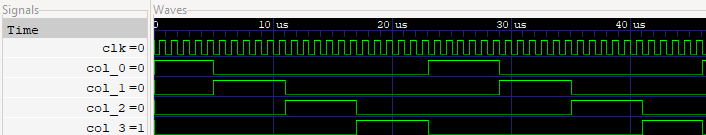
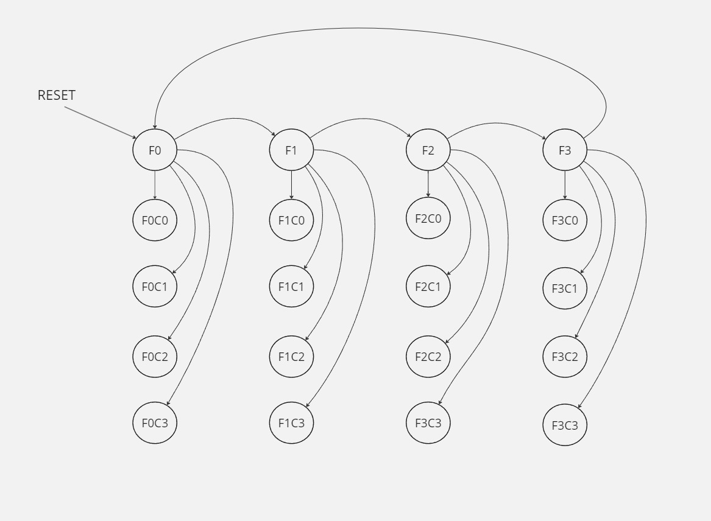
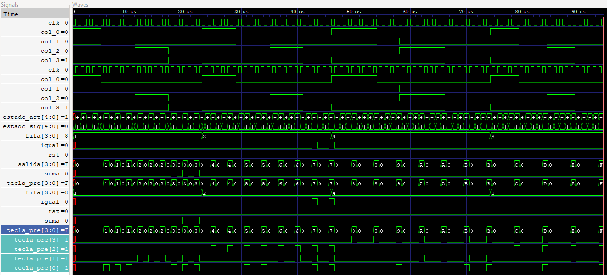
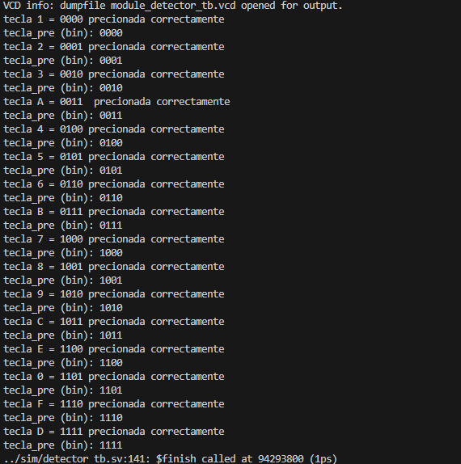
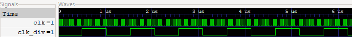
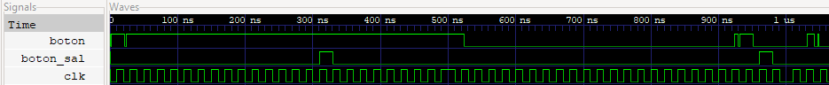

# Diseño digital sincrónico de una suma aritmética en un HDL.


## 1. Resumen


## 2. Introducción


## 3. Objetivos

- Elaborar una correcta implementación de un diseño digital sincrónico en una FPGA.
- Diseñar diferentes algoritmos en un HDL para la captura de datos de un teclado hexadecimal mecánico, sincronización de datos asincrónicos y despliegue de datos en dispositivos de 7-segmentos.
- Implementar una función de suma aritmética en un HDL.
- Construir un testbench básico para cada módulo, para la verificación de su correcto funcionamiento.

## 4. Diseño

Para realizar pedido se realizó, una partición de este mismo, en 4 subsistemas

### 4.1 Descripción general de cada subsistema

#### Capturador de teclas

Para la creación del módulo capturador de teclas se diseñó el siguiente diagrama:


De esto se tiene que, se utiliza un contador de anillo para activar las filas secuencialmente con un clk, seguidamente se implementa una FSM para detectar columnas activas, y por último se desarrolla un antirrebote de la señal detectada de la columna encendida.

Con ello se desarrolló primeramente el módulo de contador de anillo, con ello se tienen las siguientes entradas y salidas del módulo:

- `input logic clk`: Señal de clock a 27 MHz.
- `input logic rst`: Señal de reset utilizada para iniciar el estado del contador de anillo.
- `output logic [3:0]fila`: Señal de salida de 4 bits, que representa la fila encendida, además de encender y apagar pines físicos de la FPGA.

A partir de las entradas, con el clock a 27 MHz, se inicia encendiendo la primera fila, con fila_encendida <= 4'b0001, para encender las otras filas se utiliza un shifter, fila_encendida <= {fila_encendida[2:0], fila_encendida[3]}, donde pasa a encender la siguiente fila cada nuevo ciclo del clock [3].

```SystemVerilog
module cont_anillo(
    input logic clk,
    input logic rst,
    output logic [3:0]fila
);
logic [3:0]fila_encendida;
    always_ff @(posedge clk)begin
        if (rst)begin
            fila_encendida <= 4'b0001;  
        end
        else begin
            fila_encendida <= {fila_encendida[2:0], fila_encendida[3]};
        end
    end
    assign fila = fila_encendida;
endmodule
```

En la siguiente imagen se observa el comportamiento de la activación de las filas.




El segundo módulo que tratar es el detector de columna, en él se tienen las siguientes entradas y salidas:

- `input logic clk`: Señal de clock a 27 MHz.
- `input logic rst`: Señal de reset utilizada para iniciar el estado del contador de anillo.
- `input logic [3:0]fila`: Señal de entrada que corresponde a las filas activas del contador de anillo.
- `input logic col_0, col_1, col_2, col_3`: Señales de entrada provenientes de pines físicos de la FPGA.
- `output logic [3:0]tecla_pre`: Señal de 4 bits que representa el código binario de las teclas del teclado 4x4.
- `output logic suma`: Señal de salida que representa si se presionó la tecla A para realizar la suma.
- `output logic igual`: Señal de salida que representa si se presionó la tecla B para realizar la suma.


Para construir el módulo se desarrolló una FSM, para detectar si se presiona alguna configuración especifica de fila y columna, para ello se tiene un estado para cada fila, y además otros 16 estados más, que corresponden a cada una de las teclas presentes en el teclado 4x4.



Del diagrama anterior se desarrolló el siguiente código:

```SystemVerilog
module detector_columna (
    .
    .
    .
);
    typedef enum logic [4:0] { 
        F0, F1 , F2, F3, 
        F0C0, F0C1, F0C2, F0C3,
        F1C0, F1C1, F1C2, F1C3,
        F2C0, F2C1, F2C2, F2C3,
        F3C0, F3C1, F3C2, F3C3
    } estado;

    estado estado_act, estado_sig;
    logic [3:0] salida;

    always_ff @(posedge clk)begin
        if (rst)begin
            estado_act <= F0;
        end 
        else begin
            estado_act <= estado_sig;
        end
    end

    always_comb begin
        estado_sig = estado_act;
        case(estado_act)
            F0: begin
                if(fila == 4'b0001) begin
                    if (col_0) estado_sig = F0C0; 
                    else if (col_1) estado_sig = F0C1;
                    else if (col_2) estado_sig = F0C2;
                    else if (col_3) estado_sig = F0C3;
                    else estado_sig = F1;
                end
                else begin 
                    estado_sig = F1;
                end
            end
            F1: begin
                if (fila == 4'b0010)begin
                    if (col_0) estado_sig = F1C0; 
                    else if (col_1) estado_sig = F1C1;
                    else if (col_2) estado_sig = F1C2;
                    else if (col_3) estado_sig = F1C3;
                    else estado_sig = F2;
                end
                else begin 
                    estado_sig = F2;
                end
            end
            F2: begin
                if(fila == 4'b0100) begin
                    if (col_0) estado_sig = F2C0;
                    else if (col_1) estado_sig = F2C1;
                    else if (col_2) estado_sig = F2C2;
                    else if (col_3) estado_sig = F2C3;
                    else estado_sig = F3;
                end
                else begin 
                    estado_sig = F3;
                end
            end
            F3: begin
                if (fila == 4'b1000)begin
                    if (col_0) estado_sig = F3C0;
                    else if (col_1) estado_sig = F3C1;
                    else if (col_2) estado_sig = F3C2;
                    else if (col_3) estado_sig = F3C3;
                    else estado_sig = F0;
                end
                else begin 
                    estado_sig = F0;
                end
            end
            default: estado_sig = F0;
        endcase     
    end 
```

Del código anterior se observa que primero se definen los estados de la FSM, con typedef enum logic [4:0]{..Estados..}, además se definen conexiones internas, como estado estado_act, estado_sig y logic [3:0] salida; seguidamente se define la logica secuencial para el estado actual con un always_ff además de estado_act <= F0 y estado_act <= estado_sig. En el bloque de always_comb se define toda la lógica combinacional relacionada con la FSM, donde se define primeramente el estado por defecto estado_sig = estado_act, y con la función case se analizan las filas, si están activas, por medio de un if o else if se pasa al estado siguiente, que corresponde a una tecla presionada, si no se presiona pasa a la siguiente fila y repite el procedimiento, también se define F0 como la fila por defecto como estado siguiente [1].


```SystemVerilog
module detector_columna (
    .
    .
);
    .
    .
    .
    always_ff @(posedge clk) begin 
        if (rst)begin 
            salida <= 4'b0000;
        end
        else begin
            case (estado_sig)
                F0C0: salida <= 4'b0000; //1
                F0C1: salida <= 4'b0001; //2
                F0C2: salida <= 4'b0010; //3
                F0C3: salida <= 4'b0011; //A
                F1C0: salida <= 4'b0100; //4
                F1C1: salida <= 4'b0101; //5
                F1C2: salida <= 4'b0110; //6
                F1C3: salida <= 4'b0111; //B
                F2C0: salida <= 4'b1000; //7
                F2C1: salida <= 4'b1001; //8
                F2C2: salida <= 4'b1010; //9
                F2C3: salida <= 4'b1011; //C
                F3C0: salida <= 4'b1100; //E
                F3C1: salida <= 4'b1101; //0
                F3C2: salida <= 4'b1110; //F
                F3C3: salida <= 4'b1111; //D
                default: salida <= 4'b0000;
            endcase
        end
    end
    
    //asigna la salida
    assign tecla_pre = salida;
    //se activa la suma
    assign suma= (tecla_pre == 4'b0011);
    //se activa el igual
    assign igual = (tecla_pre == 4'b0111);

endmodule
```
Continuando con el código de detector de columna por medio de lógica secuencial con always_ff se detecta el estado y al estado se le asigna un código binario, que corresponde a el número del teclado presionado desde el 0 hasta el 9 y las teclas de A hasta F, y con un assign se asignan los valores de salida que es una conexión interna a la salida tecla_pre [1].

Del Anexo 8.1, donde se observa el código del testbench para el módulo de detector de columna, donde por medio de la herramienta de GTKwave y la consola, se observa como la salida tecla_pre toma los valores de las teclas presionadas.






Para el último módulo sobre el rebote mecánico se necesita un divisor de frecuencia, donde se tiene el siguiente código basado en [5]:


```SystemVerilog
module divisor (
    input logic clk,
    output reg clk_div
);
    parameter frecuencia = 27000000; //27 Mhz
    parameter fre = 1000000; //1Mhz
    parameter max_cuenta = frecuencia / (2*fre); 
    reg [4:0]cuenta;
    initial begin 
        cuenta = 0;
        clk_div = 0;
    end
    always_ff @(posedge clk) begin 
        if (cuenta == max_cuenta) begin
            clk_div <= ~clk_div;
            cuenta <= 0;
        end
        else begin
            cuenta <= cuenta+1;
        end
    end
endmodule
```
En el código, se observa que tiene una entrada, que corresponde a el clock de 27 MHz y una salida de un divisor de frecuencia a 1 MHz, donde primeramente se definen los parámetros con los valores deseados para obtener un parámetro max_cuenta que son 13 ciclos del clock a 27 MHz, se define un reg [4:0] para contar los flancos del clock, se inicia cuenta y clk_div a 0, y con la lógica secuencial, cuando cuenta llega a los 13 ciclos contados se cambia a alto o bajo, logrando un clk_div a 1 MHz [5].

Del Anexo 8.2, se tiene el testbench del divisor de frecuencia, donde se observa en la siguiente imagen el funcionamiento del módulo.




Para el módulo del rebote mecánico del teclado se basó en [6]:

```SystemVerilog
module rebote(
    input logic clk,
    input logic boton,
    output logic boton_sal
); 
    logic clk_hab;
    logic q1, q2, q2_com, q0;
    divisor clk_ha( clk, clk_hab);
    FF_D_habilitador ff1(clk, clk_hab, boton, q0);
    FF_D_habilitador ff2(clk, clk_hab, q0, q1);
    FF_D_habilitador ff3(clk, clk_hab, q1, q2);
    assign q2_com = ~q2;
    assign boton_sal = q1 & q2_com;
endmodule
```

Se utilizan tres flip flops D, para la generación de un unico pulso en la salida de boton_sal, esto cumpliendo que boton_sal = q1 & q2_com, utilizando una compuerta AND [6].


Para el módulo FF_D_habilitador, realiza la acción de que el flip-flop D, se actualiza cuando el clk_hab esta en alto, este código se basó en [6].

```SystemVerilog
module FF_D_habilitador(
    input logic clk, 
    input logic clk_hab,
    input logic D, 
    output reg Q=0
);
    always_ff @ (posedge clk) begin
        if(clk_hab == 1) 
            Q <= D;
    end
endmodule
```

En el Anexo 8.3 se puede observar el testbench del modulo del rebote mecánico, donde se puede observar su funcionamiento en la siguiente imagen.




Se realizó el módulo capturador de teclas, donde se instancian todos los módulos anteriores, obteniendo un solo bloque para manipular el subsistema de capturar las teclas.

```SystemVerilog
module capturador_de_teclas(
    input logic clk,
    input logic rst,
    input logic col_0, 
    input logic col_1, 
    input logic col_2, 
    input logic col_3,
 
    output logic [3:0]tecla_pre, 
    output logic suma,     
    output logic igual
);
    logic [3:0]fila_ent;
    logic clk_div;
    logic col_00;
    logic col_11;
    logic col_22;
    logic col_33;
    cont_anillo cont_ani_inst(
        .clk(clk),
        .rst(rst),
        .fila(fila_ent)
    );
    rebote rebote_ins0(
        .clk(clk),
        .boton(col_0),
        .boton_sal(col_00)
    );
        rebote rebote_ins1(
        .clk(clk),
        .boton(col_1),
        .boton_sal(col_11)
    );
        rebote rebote_ins2(
        .clk(clk),
        .boton(col_2),
        .boton_sal(col_22)
    );
        rebote rebote_ins3(
        .clk(clk),
        .boton(col_3),
        .boton_sal(col_33)
    );
    detector_columna detector_col_inst(
        .clk(clk),
        .rst(rst),
        .fila(fila_ent),
        .col_0(col_00),
        .col_1(col_11),
        .col_2(col_22),
        .col_3(col_33),
        .tecla_pre(tecla_pre),
        .suma(suma),
        .igual(igual)
    );
    divisor divisor_inst(
        .clk(clk),
        .clk_div(clk_div)
    );
endmodule
```


#### Almacenamiento de datos

- `entrada_i`: descripción de la entrada
- `salida_o`: descripción de la salida

```SystemVerilog
module mi_modulo(
    input logic     entrada_i,      
    output logic    salida_i 
    );
```


##### Testbench


##### Consumo de recursos


#### Display


- `entrada_i`: descripción de la entrada
- `salida_o`: descripción de la salida

```SystemVerilog
module mi_modulo(
    input logic     entrada_i,      
    output logic    salida_i 
    );
```


##### Testbench


##### Consumo de recursos


#### Sumatoria


- `entrada_i`: descripción de la entrada
- `salida_o`: descripción de la salida

```SystemVerilog
module mi_modulo(
    input logic     entrada_i,      
    output logic    salida_i 
    );
```


##### Testbench


##### Consumo de recursos


#### Control


- `entrada_i`: descripción de la entrada
- `salida_o`: descripción de la salida

```SystemVerilog
module mi_modulo(
    input logic     entrada_i,      
    output logic    salida_i 
    );
```


##### Testbench


##### Consumo de recursos


## 5. Conclusiones


## 6. Análisis de principales problemas 


## 7. Referencias
[0] David Harris y Sarah Harris. *Digital Design and Computer Architecture. RISC-V Edition.* Morgan Kaufmann, 2022. ISBN: 978-0-12-820064-3
[1] R. Gorla and R. Gorla, “Finite state machines in Verilog,” VLSI WEB, Apr. 12, 2024. https://vlsiweb.com/finite-state-machines-in-verilog/
[2] “AMD Technical Information Portal.” https://docs.amd.com/r/en-US/ug901-vivado-synthesis/FSM-Example-Verilog
[3] Luis Vargas. “Ejemplos verilog.” https://www.todopic.com.ar/foros/index.php?topic=32327.msg272414#msg272414
[4] S. P. Lung, “Divisor de Reloj en Verilog.” https://idielectronica.blogspot.com/2014/06/verilog-divisor-de-reloj.html
[5] Oscar Martínez. Tutorías con Ingenio Universidad Nacional, “Divisor de frecuencia en Verilog,” YouTube. Oct. 29, 2016. [Online]. Available: https://www.youtube.com/watch?v=sLz8vAvoils
[6] “Verilog code for debouncing buttons on FPGA,” FPGA4student.com. https://www.fpga4student.com/2017/04/simple-debouncing-verilog-code-for.html


## 8. Anexos

### 8.1 Testbench detector de columnas

```SystemVerilog
module detector_tb;
    logic clk;
    logic rst;
    logic [3:0] fila;
    logic col_0, col_1, col_2, col_3;
    logic [3:0] tecla_pre;
    logic suma;
    logic igual;
    detector_columna detector_columna_tb(
        .clk(clk),
        .rst(rst),
        .fila(fila),
        .col_0(col_0),
        .col_1(col_1),
        .col_2(col_2),
        .col_3(col_3),
        .tecla_pre(tecla_pre),
        .suma(suma),
        .igual(igual)
    );
    always #500 clk = ~clk;
    initial begin
        clk = 0;
        rst = 1;
        fila = 4'b0000;
        col_0 = 0; col_1 = 0; col_2 = 0; col_3 = 0;
        #10 rst = 0;
        //F0
        //1
        fila = 4'b0001; col_0 = 1; col_1 = 0; col_2 = 0; col_3 = 0; #5000;
        if (tecla_pre == 4'b0000) $display("tecla 1 = 0000 precionada correctamente");
        $display("tecla_pre (bin): %b", tecla_pre);
        //2
        #10;
        fila = 4'b0001; col_0 = 0; col_1 = 1; #5000;
        if (tecla_pre == 4'b0001) $display("tecla 2 = 0001 precionada correctamente");
        $display("tecla_pre (bin): %b", tecla_pre);
        //3
        #1000;
        fila = 4'b0001; col_1 = 0; col_2 = 1; #5000;
        if (tecla_pre == 4'b0010) $display("tecla 3 = 0010 precionada correctamente");
        $display("tecla_pre (bin): %b", tecla_pre);
        //A
        #1000;
        fila = 4'b0001; col_2 = 0; col_3 = 1; #5000;
        if (tecla_pre == 4'b0011) $display("tecla A = 0011  precionada correctamente");
        $display("tecla_pre (bin): %b", tecla_pre);
        //F1
        //4
        #1000;
        fila = 4'b0010; col_0 = 1; col_1 = 0; col_2 = 0; col_3 = 0; #5000;
        if (tecla_pre == 4'b0100) $display("tecla 4 = 0100 precionada correctamente");
        $display("tecla_pre (bin): %b", tecla_pre);
        //5
        #1000;
        fila = 4'b0010; col_0 = 0; col_1 = 1; #5000;
        if (tecla_pre == 4'b0101) $display("tecla 5 = 0101 precionada correctamente");
        $display("tecla_pre (bin): %b", tecla_pre);
        //6
        #1000;
        fila = 4'b0010; col_1 = 0; col_2 = 1; #5000;
        if (tecla_pre == 4'b0110) $display("tecla 6 = 0110 precionada correctamente");
        $display("tecla_pre (bin): %b", tecla_pre);
        //B
        #1000;
        fila = 4'b0010; col_2 = 0; col_3 = 1; #5000;
        if (tecla_pre == 4'b0111) $display("tecla B = 0111 precionada correctamente");
        $display("tecla_pre (bin): %b", tecla_pre);
        //F2
        //7
        #10;
        fila = 4'b0100; col_0 = 1; col_1 = 0; col_2 = 0; col_3 = 0; #8000;
        if (tecla_pre == 4'b1000) $display("tecla 7 = 1000 precionada correctamente");
        $display("tecla_pre (bin): %b", tecla_pre);
        //8
        #50;
        fila = 4'b0100; col_0 = 0; col_1 = 1; #4000;
        if (tecla_pre == 4'b1001) $display("tecla 8 = 1001 precionada correctamente");
        $display("tecla_pre (bin): %b", tecla_pre);
        //9
        #50;
        fila = 4'b0100; col_1 = 0; col_2 = 1;  #8000;
        if (tecla_pre == 4'b1010) $display("tecla 9 = 1010 precionada correctamente");
        $display("tecla_pre (bin): %b", tecla_pre);
        //C
        #50;
        fila = 4'b0100; col_2 = 0; col_3 = 1; #8000;
        if (tecla_pre == 4'b1011) $display("tecla C = 1011 precionada correctamente");
        $display("tecla_pre (bin): %b", tecla_pre);
        //F3
        //E
        #100;
        fila = 4'b1000; col_0 = 1; col_1 = 0; col_2 = 0; col_3 = 0; #5000;
        if (tecla_pre == 4'b1100) $display("tecla E = 1100 precionada correctamente");
        $display("tecla_pre (bin): %b", tecla_pre);
        //0
        #4.9;
        fila = 4'b1000; col_0 = 0; col_1 = 1;  #5000;
        if (tecla_pre == 4'b1101) $display("tecla 0 = 1101 precionada correctamente");
        $display("tecla_pre (bin): %b", tecla_pre);
        //F
        #4.9;
        fila = 4'b1000; col_1 = 0; col_2 = 1; #5000;
        if (tecla_pre == 4'b1110) $display("tecla F = 1110 precionada correctamente");
        $display("tecla_pre (bin): %b", tecla_pre);
        //D
        #4;
        fila = 4'b1000; col_2 = 0; col_3 = 1; #5000;
        if (tecla_pre == 4'b1111) $display("tecla D = 1111 precionada correctamente");
        $display("tecla_pre (bin): %b", tecla_pre);
        $finish;
    end
    initial begin // Para el diagrama de tiempos
        $dumpfile("module_detector_tb.vcd");
        $dumpvars(0, detector_tb); // Nombre correcto del testbench
    end
endmodule
```

Se realizó el anterior testbench, donde se le asignan los valores de las columnas encendidas o apagadas, con las columnas activas para detectar y generar los pulsos para la salida de tecla_pre, con ello en tecla_pre se genera el código binario correspondiente a la tecla presionada. Se utiliza un if para asegurar de que la salida toma el dato de los 4 bits.


### 8.2 Testbench divisor de frecuencia


```SystemVerilog
`timescale 1ns/1ps

module divisor_tb;
    logic clk;
    logic clk_div;
    divisor divisor_tbb(
        .clk(clk),
        .clk_div(clk_div)
    );
    initial begin   
        clk = 0;
        forever begin
            #18.52 clk = ~clk;
        end
    end
    initial begin  
        $monitor("Tiempo: %0t | clk = %b | clk_div = %b", $time, clk, clk_div);
        // Para el diagrama de tiempos
        $dumpfile("module_divisor_tb.vcd");
        $dumpvars(0, divisor_tb); // Nombre correcto del testbench
        #10000 $finish;
    end
endmodule
```
Se tiene el testbench del divisor de frecuencia, donde el clock se asigna a 1 MHz con #18.5 clk = ~clk, y se monitorean, el tiempo, el clk y el clk_div.


### 8.3 Testbench rebote mecánico de teclado

```SystemVerilog
module rebote_tb;
    reg boton;
    reg clk;
    logic boton_sal;
    rebote rebote_tbb(
        .boton(boton),
        .clk(clk),
        .boton_sal(boton_sal)
    );
    always #500 clk = ~clk; // Reloj de (27 MHz)
    initial begin
        clk = 0;
        forever begin
            #10 clk = ~clk;
        end
    end
    initial begin
        boton = 0;
        #2;
        boton = 1;
        #20;
        boton = 0;
        #2;
        boton = 1;
        #50;
        boton = 0;
        #400;
        boton = 1;
        #5;
        boton = 0;
        #2;
        boton = 1;
        #20;
        boton = 0;
        #80;
        boton = 1;
        #10;
        boton = 0;
        #5;
        boton = 1;
        #2;
        boton = 0;
        #100;
        boton = 1;
        $finish;
    end
    initial begin // Para el diagrama de tiempos
        $dumpfile("module_rebote_tb.vcd");
        $dumpvars(0, rebote_tb); // Nombre correcto del testbench
    end
endmodule
```


Para este testbench se trata de generar pulsos con ruido antes y después de un pulso de mayor duración.
