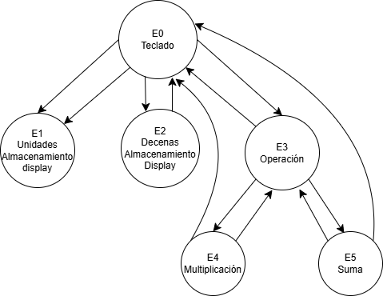
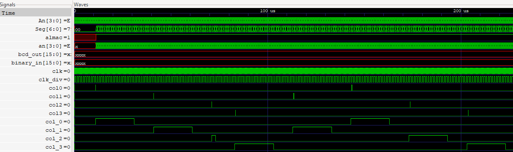
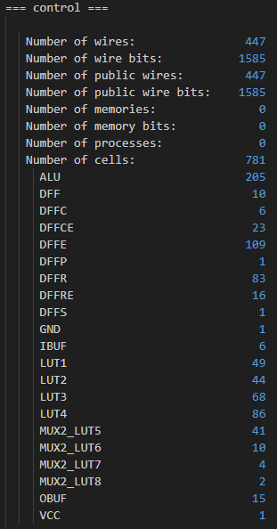
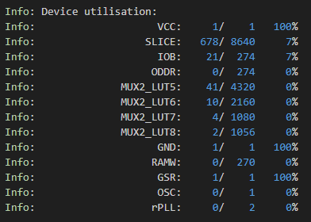
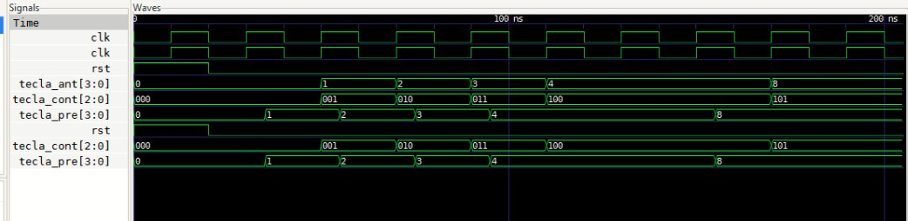
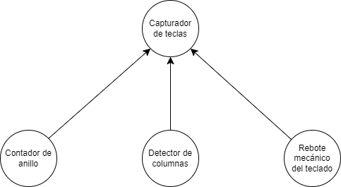
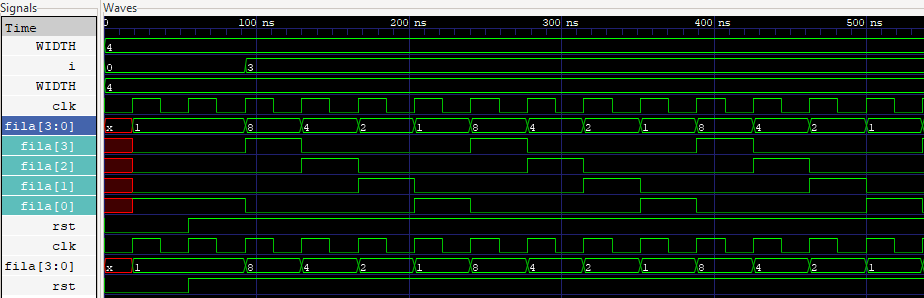
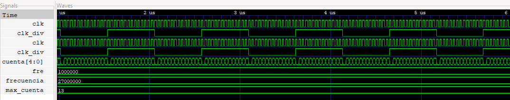

# Diseño digital sincrónico de una multiplicación con algoritmo de Booth
<h2 align="center">Alejandro Bejarano 2018265149, Jimena Vargas 2023075218 </h2>


## 1. Resumen
Este informe presenta los detalles de un programa digital sincrónico, el cual está programado en un lenguaje de hardware (HDL), captura los datos de un teclado hexadecimal y los almacena en un módulo para después implementar una multiplicación con el algoritmo de Booth, y, por último, desplegar el resultado en un display de 4 dígitos, todo esto controlado por un módulo llamado control.

##### Introducción
Se aborda el diseño de un sistema digital que puede capturar números desde un teclado y realizar una multiplicación con el algoritmo de Booth, mostrando el resultado en una pantalla de 7 segmentos. La idea principal es utilizar un HDL, específicamente SystemVerilog, para crear un sistema sincronizado, donde todos los componentes funcionan al mismo "reloj" interno de 27 MHz. Con ello se pretende que, al ingresar números con el teclado hexadecimal, estos se almacenen y luego se multipliquen correctamente, mostrando el resultado en tiempo real en un display de 4 dígitos, además todo el sistema se implementa en una FPGA.


## 2. Problema, objetivos y especificaciones 
##### Problema 
Diseñar un sistema digital sincrónico en un HDL, para ser cargado en una FPGA, implementando varios métodos que procesen diferentes datos y señales con el mismo reloj, este a 27 MHz, para evitar errores de sincronización, este debe ingresar dos números de dos dígitos cada uno, que pasen por subsistemas de almacenamiento, multiplicación y despliegue de datos.


##### Objetivos
- Estudiar y desarrollar un testbench para el código del multiplicador de Booth.
- Elaborar un sistema tipo calculadora que realice una multiplicación por medio del algoritmo de Booth.
- Elaborar una correcta implementación de un diseño digital sincrónico en una FPGA.
- Construir un testbench básico para cada módulo desarrollado, con el fin de verificar el correcto funcionamiento de cada subsistema.


##### Especificaciones 
- Subsistema de lectura del teclado hexadecimal con captura de datos, eliminación de rebote y sincronización de los datos a partir de un teclado mecánico.
- Subsistema de almacenamiento de datos ingresados por el subsistema de lectura.
- Subsistema de multiplicación con algoritmo de Booth.
- Subsistema de despliegue de los números ingresados y del resultado de la multiplicación en cuatro dispositivos de 7 segmentos.


## 4. Diseño
Para realizar lo pedido, se realizó una partición de este mismo sistema a desarrollar, en varios subsistemas.


### 4.1 Descripción general de cada subsistema

#### Control (maquina de estado)

La creación de este módulo se diseñó basado el siguiente diagrama de una FSM:



De este se puede observar que se definieron varios estados de la FSM de control del sistema general, E0, E1, E2, E3, E4 y E5, sucesivamente estos corresponden a el estado de espera, el estado de decimales, estado de unidades, estado de operación, estado de multiplicación y estado de suma.

##### Entradas y salidas
- `input logic clk`: Señal de clock a 27 MHz, pin de la FPGA.
- `input logic rst`: Señal de reset utilizada para reiniciar el sistema, se le asignó a un botón de la FPGA.
- `input logic col_0`: Señal de entrada de 1 bit, además hay otros tres entradas de col_1, col_2 y col_3, que corresponden a pines físicos de la FPGA.
- `output logic [6:0] seg`: Señales de salidas físicas en la FPGA, esto para los 7-segmentos, en representación de los segmentos a, b, c, d, e, f y g.
- `output logic [3:0] an`: Señales de salidas físicas en la FPGA, esto para activar 4 transistores, que funcionan como interruptores.
- `output logic [3:0]fila`: Señal de salida de 4 bits, que representa la fila encendida, además de encender y apagar pines físicos de la FPGA.

A continuación se muestra la FSM planteada para el módulo de control:

``` SystemVerilog
    typedef enum logic [2:0] { 
        E0, E1 , E2, E3, E4, E5
    } estado;

    estado estado_act, estado_sig;

        //Para el estado actual
    always_ff @(posedge clk or posedge rst)begin
        if (rst)begin
            estado_act <= E0; //estado de espera
        end 
        else begin
            estado_act <= estado_sig;
        end
    end


    //Logica de cada estado
    always_ff @(posedge clk) begin
        estado_sig = estado_act;
        case(estado_act)

            E0: begin
                if(fila == 4'b0001) begin
                    if (col0 != 4'b0) tecla_pre = 4'b0001; //1
                    else if (col1 != 4'b0) tecla_pre = 4'b0010; //2
                    else if (col2 != 4'b0) tecla_pre = 4'b0011; //3
                    else if (col3 != 4'b0) tecla_pre = 4'b1010; //A
                    else estado_sig = E0;
                end
                else if(fila == 4'b0010) begin
                    if (col0 != 4'b0) tecla_pre = 4'b0100; //4
                    else if (col1 != 4'b0) tecla_pre = 4'b0101; //5
                    else if (col2 != 4'b0) tecla_pre = 4'b0110; //6
                    else if (col3 != 4'b0) tecla_pre = 4'b1011; //B
                    else estado_sig = E0;
                end
                else if(fila == 4'b0100) begin
                    if (col0 != 4'b0) tecla_pre = 4'b0111; //7
                    else if (col1 != 4'b0) tecla_pre = 4'b1000; //8
                    else if (col2 != 4'b0) tecla_pre = 4'b1001; //9
                    else if (col3 != 4'b0) tecla_pre = 4'b1100; //C
                    else estado_sig = E0;
                end
                else if(fila == 4'b1000) begin
                    if (col0 != 4'b0) tecla_pre = 4'b1110; //E
                    else if (col1 != 4'b0) tecla_pre = 4'b0000; //0
                    else if (col2 != 4'b0) tecla_pre = 4'b1111; //F //***
                    else if (col3 != 4'b0) tecla_pre = 4'b1101; //D
                    else estado_sig = E0;
                end
                else if (tecla_cont == 3'b001 || tecla_cont == 3'b100) estado_sig = E1; //Pasa al estado de decimal.
                else if (tecla_cont == 3'b010 || tecla_cont == 3'b101) estado_sig = E2; //Pasa al estado de unidades.
                else if (tecla_cont == 3'b011 || tecla_cont == 3'b110) estado_sig = E3; //Pasa al estado de operacion.
                else begin
                    estado_sig = E0; //Estado de espera.
                end
            end

            //Decenas
            E1: begin
                if (tecla_cont == 3'b001) begin
                    tecla <= tecla_pre;
                    if (almac == 1) begin 
                        num1_dec1 <= tecla;
                        result <= num1_dec1;
                        seg[0] = Seg[0];
                        seg[1] = Seg[1];
                        seg[2] = Seg[2];
                        seg[3] = Seg[3];
                        seg[4] = Seg[4];
                        seg[5] = Seg[5];
                        seg[6] = Seg[6];
                        an[0] = An[0];
                        an[1] = An[1];
                        an[2] = An[2];
                        an[3] = An[3]; 
                    end
                    almac <= 1'b1;
                end 
                else if (tecla_cont == 3'b100) begin 
                    tecla <= tecla_pre;
                    if (almac == 1) begin
                        num2_dec1 <= tecla;
                        result <= num2_dec1;
                        seg[0] = Seg[0];
                        seg[1] = Seg[1];
                        seg[2] = Seg[2];
                        seg[3] = Seg[3];
                        seg[4] = Seg[4];
                        seg[5] = Seg[5];
                        seg[6] = Seg[6];
                        an[0] = An[0];
                        an[1] = An[1];
                        an[2] = An[2];
                        an[3] = An[3]; 
                    end
                    almac <= 1'b1;
                end
                    else begin 
                    estado_sig = E0;
                end
            end

        // Unidades
            E2: begin
                if (tecla_cont == 3'b010) begin
                    tecla <= tecla_pre;
                    almac <= 1'b1;

                    if (almac == 1) begin 
                        num1_dec2 <= tecla;
                        result <= num1_dec2;
                        seg[0] = Seg[0];
                        seg[1] = Seg[1];
                        seg[2] = Seg[2];
                        seg[3] = Seg[3];
                        seg[4] = Seg[4];
                        seg[5] = Seg[5];
                        seg[6] = Seg[6];
                        an[0] = An[0];
                        an[1] = An[1];
                        an[2] = An[2];
                        an[3] = An[3]; 
                    end   
                end 
                else if (tecla_cont == 3'b100) begin 
                    tecla <= tecla_pre;
                    almac <= 1'b1;

                    if (almac ==1) begin
                        num2_dec2 <= tecla_pre;
                        result <= num2_dec2;
                        seg[0] = Seg[0];
                        seg[1] = Seg[1];
                        seg[2] = Seg[2];
                        seg[3] = Seg[3];
                        seg[4] = Seg[4];
                        seg[5] = Seg[5];
                        seg[6] = Seg[6];
                        an[0] = An[0];
                        an[1] = An[1];
                        an[2] = An[2];
                        an[3] = An[3]; 
                    end 
                end 
                else begin 
                    estado_sig = E0;
                end 
            end

            E3: begin
                if (tecla_cont == 3'b011) begin
                    if (tecla_pre == 4'b1011) begin //Multiplicacion
                        tecla_opera = tecla_pre;
                        if (tecla_opera == tecla_pre) estado_sig = E0;
                        else begin
                            estado_sig = E0;
                        end
                    end
                    else if (tecla_pre == 4'b1010) begin //suma
                        tecla_opera = tecla_pre;
                        if (tecla_opera == tecla_pre) estado_sig = E0;
                        else begin
                            estado_sig = E0;
                        end
                    end
                    else begin
                        estado_sig = E0;
                    end
                end
                else if (tecla_cont == 3'b110) begin
                    if (tecla_pre == 4'b1100) begin
                        if (tecla_opera == 4'b1011) estado_sig = E4;
                        else if (tecla_opera == 4'b1010) estado_sig = E5;
                        else begin
                            estado_sig = E0;
                        end
                    end
                end
                else begin
                    estado_sig = E0;
                end
            end

            E4: begin
                if (tecla_cont == 3'b110 && tecla_opera == 4'b1011 ) begin 
                    start = 1'b1;
                    if (start == 1) begin
                        num1 <= num_result1;
                        num2 <= num_result2;
                        start = 1'b1;
                    end
                    if (start == 1) begin
                        num1 <= num_result1;
                        num2 <= num_result2;
                    end
                    else if (done == 1) begin
                        binary_in <= resultado;
                        result <= bcd_out;
                        binary_in <= resultado;
                        result <= bcd_out;
                        seg[0] = Seg[0];
                        seg[1] = Seg[1];
                        seg[2] = Seg[2];
                        seg[3] = Seg[3];
                        seg[4] = Seg[4];
                        seg[5] = Seg[5];
                        seg[6] = Seg[6];
                        an[0] = An[0];
                        an[1] = An[1];
                        an[2] = An[2];
                        an[3] = An[3]; 
                    end 
                else begin
                    estado_sig = E0;
                end
                end
            end 
            E5: begin
                if (tecla_opera == 4'b1010) begin
                    if (num1 != 4'b0 && num2 != 4'b0) begin
                        result = sum;
                        seg[0] = Seg[0];
                        seg[1] = Seg[1];
                        seg[2] = Seg[2];
                        seg[3] = Seg[3];
                        seg[4] = Seg[4];
                        seg[5] = Seg[5];
                        seg[6] = Seg[6];
                        an[0] = An[0];
                        an[1] = An[1];
                        an[2] = An[2];
                        an[3] = An[3]; 
                    end
                end
                else if (tecla_opera != 4'b1010) estado_sig = E0;
                else begin
                    estado_sig = E0;
                end
            end
            default: estado_sig = E0;
        endcase
    end
endmodule
```

En el código se observa la definición de los estados de la FSM, E0, E1, E2, E3, E4 y E5, además se utilizó una lógica secuencial con el always_ff, para los cambios de estados, mediante el clk.

Para el primer estado E0, se desarrolló la lógica sobre los arreglos de entrada y salida, que corresponden a las columnas y filas del teclado respectivamente, por lo tanto, si se enciende una fila, por medio del contador de anillo, el subsistema seguidamente detectaba si alguna señal de entrada llegaba a las columnas(pines físicos de la FPGA), por lo cual si se detectaba una fila y columna especifica, a la variable tecla_pre se le asigna el valor binario de 4 bits de la tecla que se presiona, un ejemplo en el caso del número 1 sería el 0001, las entradas de las columnas pasan por un módulo de rebote, por lo que se elimina el rebote mecánico del teclado.



En la Figura anterior se observa como cada pulso detectado por el módulo de rebote a las entradas de las columnas, se le asigna un único pulso a la salida para eliminar el rebote.


Para el análisis de consumo de recursos en la FPGA y del consumo de potencia que reportan las herramientas, los siguientes valores generados con el make synth y make pnr.




De esto, se destacan el consumo de recursos lógicos en la FPGA, como lo son los look-up-tables (LUTs), estos corresponde a el tamaño de tablas de búsqueda utilizadas, donde se implementa el sistema de capturar las teclas, además se tienen los Wires, que se utilizan 447, que corresponden a conexiones internas que ocupan 1585 bits, y 205 ALU que corresponden a unidades aritméticas lógicas para realizar operaciones lógicas o matemáticas, además se utilizaron flip-flops D, para almacenar estados, como también la utilización de varios multiplexores.


###### Contador de la FSM

- `input  logic clk`: Señal del clk para controlar las operaciones.
- `input  logic rst`: Señal de reset que reinicia el módulo a un estado inicial.
- `input logic [3:0] tecla_pre`: Entrada que representa el valor actual de la tecla presionada.
- `output logic [2:0] tecla_cont`: Contador que incrementa cada vez que cambia el valor de tecla_pre

Variables internas

- `logic [3:0] tecla_ant`: Almacena el valor anterior de tecla_pre para compararlo con el valor actual.

``` SystemVerilog
/module cont_tecla (
    input logic clk,
    input logic rst,
    input logic [3:0] tecla_pre,

    output logic [2:0] tecla_cont
);

logic [3:0] tecla_ant;

always_ff @(posedge clk or posedge rst) begin
    if (rst) begin
        tecla_ant <= 4'b0000;
        tecla_cont <= 3'b000;
    end
    else if (tecla_pre != tecla_ant) begin
        tecla_ant <= tecla_pre;
        tecla_cont <= tecla_cont + 1;
    end
end
endmodule
```

Se implemento este codigo para saber cuando cambiar de estado y es que por cada tecla_pre que se iba presionando el contador de la tecla_cont iba sumando y así se podia saber a que estado tenia que ir para la maquina de estado.
El funcionamiento del codifo es el siguiente: El módulo utiliza un bloque always_ff que se ejecuta en cada flanco positivo del reloj (clk) o cuando se activa la señal de rst, despue compara si la tecla_pre es igual a la tecla_ant y en el caso de que si lo sea la tecla_ant toma el valor de la tecla_pre y la tecla_cont se incrementa en 1 para guardar el cambio.



En la imagen del make wv se puede apresiar como va aumentando la tecla_cont con cada cambio de la tecla_pre.

#### Capturador de teclas

Para la creación del módulo capturador de teclas se diseñó el siguiente diagrama:



Este corresponde al mismo método desarrollado para el sistema capturador de teclas de la Tarea 2, ya que se partió de ahí para desarrollar y mejorar un nuevo módulo para este sistema.

Dado que se implementó la deteccion de teclas en el módulo de control, y su devida explicación de funcionamiento, en esta sección se comentará un poco sobre el contador de anillo, divisor de reloj y el rebote mecanico del teclado.


##### Entradas y salidas
- `input logic clk`: Señal de clock a 27 MHz, pin de la FPGA.
- `input logic rst`: Señal de reset utilizada para reiniciar el subsistema.
- `output logic [3:0] fila`: Salida física de la FPGA, para poner en alto los pines de la FPGA mediante un shifter.
- `output logic boton_sal`: Salida de un pulso al pasar por el módulo del rebote.
- `output reg clk_div`: Salida de un clk a menor frecuencia que el clk de entrada.

``` SystemVerilog
module anillo_ctdr
(
    input logic clk,
    input logic rst,
    output logic [3:0] fila
);
always_ff @(posedge clk or negedge rst) begin
    if (!rst) 
        fila <= 4'b0001; 
    else 
        fila <= {fila[2:0], fila[3]};
end
endmodule
```
En el código anterior del contador de anillo se observa que se utilizó una lógica secuencial, para hacer un shifter, con el cual se inicia encendiendo el primer bit 0001, y con cada cambio creciente en el clk, se realiza un shift para el bit en alto.



``` SystemVerilog
module rebote(
    input logic clk,
    input logic boton,
    output logic boton_sal
); 
    logic clk_hab;
    logic q1, q2, q2_com, q0;

    divisor clk_ha( clk, clk_hab);

    FF_D_habilitador ff1(clk, clk_hab, boton, q0);
    FF_D_habilitador ff2(clk, clk_hab, q0, q1);
    FF_D_habilitador ff3(clk, clk_hab, q1, q2);

    assign q2_com = ~q2;
    assign boton_sal = q1 & q2_com;
endmodule
module FF_D_habilitador(
    input logic clk, 
    input logic clk_hab,
    input logic D, 
    output reg Q=0
);
    always_ff @ (posedge clk) begin
        if(clk_hab == 1) 
            Q <= D;
    end
endmodule 
```
Para el módulo de rebote se utilizan tres flip flops D, para la generación de un unico pulso en la salida de boton_sal, esto cumpliendo que boton_sal = q1 & q2_com, utilizando una compuerta AND [6].

Para el módulo FF_D_habilitador, realiza la acción de que el flip-flop D, se actualiza cuando el clk_hab esta en alto, este código se basó en [6].

``` SystemVerilog
module divisor (
    input logic clk,
    output reg clk_div
);
    parameter frecuencia = 27000000; //27 Mhz
    parameter fre = 1000000; //10hz
    parameter max_cuenta = frecuencia / (2*fre); //13.5 ciclos aprox 
    reg [4:0]cuenta;
    initial begin 
        cuenta = 0;
        clk_div = 0;
    end
    always_ff @(posedge clk) begin 
        if (cuenta == max_cuenta) begin //la cantidad de ciclos en alto o bajo
            clk_div <= ~clk_div;
            cuenta <= 0;
        end
        else begin
            cuenta <= cuenta+1;
        end
    end
endmodule
```
En el módulo del divisor del clk, se observa que tiene una entrada, que corresponde a el clock de 27 MHz y una salida de un divisor de frecuencia a 1 MHz, donde primeramente se definen los parámetros con los valores deseados para obtener un parámetro max_cuenta que son 13 ciclos del clock a 27 MHz, se define un reg [4:0] para contar los flancos del clock, se inicia cuenta y clk_div a 0, y con la lógica secuencial, cuando cuenta llega a los 13 ciclos contados se cambia a alto o bajo, logrando un clk_div a 1 MHz [5].




#### multiplicador

##### Entradas y salidas
- `input  logic clk`: Señal del clk para controlar las operaciones.
- `input  logic start`: Señal para iniciar la operacion multiplicación.
- `input  logic [7:0] A`: Es el primer operador para la multiplicación.
- `input  logic [7:0] B`: Es el segundo operador para la multiplicación.
- `output logic done`: Señal para indicar que la operacion ya finalizo.
- `output logic [15:0] resultado`: Es el resultado de la operación multiplicación que puede dar un valor máximo de 4 numeros 16 bits en binario.
###### Variables internas
- `logic [15:0] acumulador`: Almacena el resultado parcial de la suma durante el proceso de la multipolicación.
- `logic [7:0] contador`: Lleva el conteo de las iteraciones realizadas.
- `logic [7:0] multiplicando`: Almacena el valor de 
𝐴
- `logic [7:0] multiplicador`:Almacena el valor de 
𝐵
- `logic busy`: Señal que indica que el módulo está ocupado realizando la multiplicación.

``` SystemVerilog
// Modulo de multiplicador
//*************************
//*************************
module multiplicador(
    input  logic [7:0] A,
    input  logic [7:0] B, 
    input  logic clk,    
    input  logic start,   
    output logic [15:0] resultado, 
    output logic done   
);
    logic [15:0] acumulador;
    logic [7:0] contador;
    logic [7:0] multiplicando;
    logic [7:0] multiplicador;
    logic busy;

    always_ff @(posedge clk) begin
        if (start) begin
            // Inicializamos los valores
            acumulador <= 16'd0;
            multiplicando <= A;
            multiplicador <= B;
            contador <= 8'd0;
            busy <= 1;
            done <= 0;
        end else if (busy) begin
            if (contador < multiplicador) begin
                acumulador <= acumulador + multiplicando;
                contador <= contador + 1;
            end else begin
                resultado <= acumulador;
                done <= 1;
                busy <= 0;
            end
        end
    end

endmodule
```
La inicialización pasa cuando la señal start se activa en 1 se inicializan las variables internas y en busy hace que el modulo entre en un estado ocupado. Durante el proseso de la multiplicación durante cada ciclo de reloj si contado es menor que el valor de multiplicaodor (B) el valor del multiplicando (A) se le suma al acumulador y el contador se incrementa en 1 y finaliza cuando el contador alcanza el valor de multiplicador (B) y el dato en acumulador se tranfiere a resultado, la señal done se activa y se desactiva el busy.


 
 En la figura enterior se muestra como la señal del busy y start se activan al inicio, se realiza la multiplicacion cuando termina se desactiva el busy y sale el resultado

#### almacenamiento

##### Entradas y salidas
- `input logic clk`: Señal de reloj para operaciones síncronas.
- `input logic rst`: Señal de reinicio para reiniciar los valores almacenados.
- `input logic almac`: Señal de control para habilitar el almacenamiento de los resultados.
- `input logic [3:0] num1_dec1`: Dígito en BCD del primer número.
- `input logic [3:0] num1_dec2`: Dígito en BCD del segundo número.
- `input logic [3:0] num2_dec1`: Dígito en BCD del segundo número.
- `input logic [3:0] num_dec2`: Dígito en BCD del segundo número.
- `output logic [11:0] num_result1`: Número completo generado a partir de num1_de1 y num1_dec2
- `output logic [11:0] num_result2`:  Número completo generado a partir de mum2_dec1 y num2_dec2.

``` SystemVerilog
module almacenamiento(
    input logic clk,
    input logic rst,
    input logic almac,
    input logic [3:0] num1_dec1,   
    input logic [3:0] num1_dec2,   
    input logic [3:0] num2_dec1,  
    input logic [3:0] num2_dec2,  
    output logic [11:0] num_result1, 
    output logic [11:0] num_result2  
);

    always_ff @(posedge clk or posedge rst) begin
        if (rst) begin
            num_result1 <= 12'b0;
            num_result2 <= 12'b0;
        end 
        else if (almac) begin

            num_result1 <= (num1_dec1 * 10) + num1_dec2; 
            num_result2 <= (num2_dec1 * 10) + num2_dec2; 
        end
    end

endmodule
```
La funcionalidad del modulo esta dentro del almays_ff sensible al flanco positivo del reloj posedge clk y el flanco positivo posedg rst. 
Inicia con el rst reiniciando y cuando se desactiva verifia se almac esta activado convirtiendo a un número decimal completo multiplicando el primer dígito (num1_dec1 o num2_dec1) por 10 y sumando el segundo dígito (num1_dec2 o num2_dec2). El resultado se almacena en las salidas num_result1 y num_result2. Por ultimo almac se desactiva y termina el módulo.


#### Display

##### Entradas y salidas
- `input logic clk`:Señal de reloj para operaciones síncronas.
- `input logic [15:0] result`:  Número que se desea mostrar en el display de 7 segmentos. Cada 4 bits representan un dígito
- `output logic [6:0] Seg`: Señales que controlan los segmentos del display. Cada bit activa un segmento específico.
- `output logic [3:0] anodes`: Señales que controlan los ánodos comunes del display para seleccionar qué dígito está activo.
###### Variables internas
- `logic [6:0] number`: Configuración del estado de los segmentos para el dígito activo.
- `logic [3:0] state = 4'b0000`: Controla qué dígito del display está activo.
- `logic [15:0] data`: Igual a result, se utiliza como referencia interna para acceder a los dígitos individuales.
- `logic [3:0] dig`: Dígito actual que se está procesando (4 bits extraídos de data).
- `logic slow_clock = 0`: Reloj más lento generado internamente.
- `integer count = 0`: Contador para generar el reloj lento.

``` SystemVerilog

module display (
    input logic [15:0] result,
    input logic clk,
    output logic [6:0] Seg,
    output logic [3:0] anodes
);
    logic [6:0] number;
    logic [3:0] state = 4'b0000; 
    logic [15:0] data;
    logic [3:0] dig;
    logic slow_clock = 0;
    integer count = 0;
    assign data = result;
    // Generador de reloj lento
    always_ff @(posedge clk) begin
        if (count > 2) begin
            count <= 0;
            slow_clock <= ~slow_clock;
        end else begin
            count <= count + 1;
        end
    end
    // Control de anodos y segmentos
    always_ff @(posedge slow_clock) begin
        case (state)
            4'b0000: begin
                anodes = 4'b1110;
                state = 4'b0001;
                dig = data[3:0];
            end
            4'b0001: begin
                anodes = 4'b1101;
                state = 4'b0010;
                dig = data[7:4];
            end
            4'b0010: begin
                anodes = 4'b1011;
                state = 4'b0011;
                dig = data[11:8];
            end
            4'b0011: begin
                anodes = 4'b0111;
                state = 4'b0000;
                dig = data[15:12];
            end
        endcase

        case (dig)
            4'b0000: number = 7'b1000000; // 0
            4'b0001: number = 7'b1111001; // 1
            4'b0010: number = 7'b0100100; // 2
            4'b0011: number = 7'b0110000; // 3
            4'b0100: number = 7'b0011001; // 4
            4'b0101: number = 7'b0010010; // 5
            4'b0110: number = 7'b0000010; // 6
            4'b0111: number = 7'b1111000; // 7
            4'b1000: number = 7'b0000000; // 8
            4'b1001: number = 7'b0011000; // 9
            4'b1010: number = 7'b0001000; // A
            4'b1011: number = 7'b0000011; // B
            4'b1100: number = 7'b1000110; // C
            4'b1101: number = 7'b0100001; // D
            4'b1110: number = 7'b0000110; // E
            4'b1111: number = 7'b0001110; // F
            default: number = 7'b0000000; // Apagado
        endcase
    end

    assign Seg = number;

endmodule
```
El módulo utiliza un contador para reducir la frecuencia del reloj (clk) y generar un slow_clock, que se utiliza para alternar entre los dígitos del display, despues un bloque always_ff se ejecuta en cada flanco positivo de slow_clock para alternar entre los dígitos y determinar qué parte del número (data) se debe mostrar y para mostralo el dígito actual (dig) se convierte en un patrón de 7 segmentos para el display usando un case para cada numero del 0 al F, sin embargo para este proyecto solo que ocupaba del 0 al 9 y finalmente, el valor calculado en number se asigna a Seg para mostrar el dígito correspondiente.


#### Codificador BCD

##### Entradas y salidas
- `input logic clk`: Señal de reloj para operaciones síncronas.
- `input  logic [15:0] binary_in`: Número binario que se quiere convertir a BCD
- `output logic [15:0] bcd_out`:  Representación del número en formato BCD. Cada 4 bits representan un dígito decimal

###### Variables internas
- `logic [31:0] shift_reg`: Registro de desplazamiento que almacena.
- `int state`: Controla el número de iteraciones del algoritmo. El algoritmo realiza 16 pasos, uno por cada bit del número binario.

``` SystemVerilog
module codificador_bcd (
    input  logic clk,
    input  logic [15:0] binary_in,
    output logic [15:0] bcd_out
);
    logic [31:0] shift_reg;
    int state;

    always_ff @(posedge clk) begin
        if (state == 0) begin
            shift_reg = {16'b0, binary_in};  
            state = 1; 
        end else if (state <= 16) begin
            for (int j = 0; j < 4; j++) begin
                if (shift_reg[19 + 4*j -: 4] >= 5) begin
                    shift_reg[19 + 4*j -: 4] += 3;
                end
            end
            shift_reg = shift_reg << 1; 
            state = state + 1; 
        end else begin

            bcd_out = shift_reg[31:16];
            state = 0;
        end
    end
endmodule
```
El módulo inicia en state cero con el binary_in en cero y para el convertir el número se utiliza el proceso de conversio Double Dabble donde son 16 estados desplazar el bit más significativo del binario hacia los dígitos BCD, despues ajustar los valores en los dígitos BCD si son mayores o iguales a 5 y por último lo repetir hasta procesar los 16 bits.


## 5. Conclusiones
El desarrollo del sistema digital sincrónico para la realización de la multiplicación con el algoritmo de Booth, demostró un correcto funcionamiento de cada módulo por separado en SystemVerilog, en donde se manejaron los datos de manera eficiente y sincronizada, esto observado en los testbenches de cada módulo, pero al realizar el módulo del control, se pretendió que el módulo se encargara de realizar todas las tareas en una sola FSM, dado que se volvió estremadamente complejo la FSM, el sistema presentó problemas de lecturas, por lo que se recomendo utilizar varias FSM's con banderas, para no sobrecargar la FSM principal.


## 6. Análisis de principales problemas 
- Se tuvo un problema al analizar el módulo brindado para la multiplicación con el algoritmo de Booth, al momento de realizar un testbench y comprobar el resultado.
- Se presentaron problemas con el contador de anillo, ya que, en el módulo del control, al realizar el testbench no se logró apreciar el funcionamiento correcto al iniciar cada pulso de salida para cada fila.
- Se presentaron problemas en el módulo del rebote mecánico, ya que no detectaba todas las señales de entrada.
- En el módulo de control, no se logró cumplir con los objetivos planteados ya que no funcionó el código y método planteados.


## 7. Referencias
[1] R. Gorla and R. Gorla, “Finite state machines in Verilog,” VLSI WEB, Apr. 12, 2024. https://vlsiweb.com/finite-state-machines-in-verilog/

[2] “AMD Technical Information Portal.” https://docs.amd.com/r/en-US/ug901-vivado-synthesis/FSM-Example-Verilog

[3] Luis Vargas. “Ejemplos verilog.” https://www.todopic.com.ar/foros/index.php?topic=32327.msg272414#msg272414

[4] S. P. Lung, “Divisor de Reloj en Verilog.” https://idielectronica.blogspot.com/2014/06/verilog-divisor-de-reloj.html

[5] Oscar Martínez. Tutorías con Ingenio Universidad Nacional, “Divisor de frecuencia en Verilog,” YouTube. Oct. 29, 2016. [Online]. Available: https://www.youtube.com/watch?v=sLz8vAvoils

[6] “Verilog code for debouncing buttons on FPGA,” FPGA4student.com. https://www.fpga4student.com/2017/04/simple-debouncing-verilog-code-for.html

[7] V. T. L. E. De Miguel Alberto Davila Sacoto, “Multiplexación,” Curso De FPGAs, Feb. 26, 2018. https://cursofpga.wordpress.com/2018/02/25/multiplexacion-y-simulacion-de-circuitos-secuenciales/

[8] Curso FPGA, "Multiplexación y simulación de circuitos secuenciales," Curso FPGA Blog, Feb. 25, 2018. [Online]. Available: https://cursofpga.wordpress.com/2018/02/25/multiplexacion-y-simulacion-de-circuitos-secuenciales/. [Accessed: Oct. 8, 2024].

[9] David Harris y Sarah Harris. *Digital Design and Computer Architecture. RISC-V Edition.* Morgan Kaufmann, 2022. ISBN: 978-0-12-820064-3

[10] S. Edwards, Memory in Digital Systems. [Online]. Available: https://www.cs.columbia.edu/~sedwards/classes/2015/4840/memory.pdf. [Accessed: 21-Nov-2024].


Aquí tienes las referencias en formato IEEE para los enlaces proporcionados:

[11] ElectroBinary, Memory. [Online]. Available: https://electrobinary.blogspot.com/2020/04/memory.html. [Accessed: 21-Nov-2024].

[12] ChipVerify, Verilog Arrays and Memories. [Online]. Available: https://www.chipverify.com/verilog/verilog-arrays-memories. [Accessed: 21-Nov-2024].


## 8. Anexos

### 8.1 Anexo: Testbench detector de columnas
``` SystemVerilog
`timescale 1ns/1ps

module detector_tb;

    // Declaración de señales
    logic clk;
    logic rst;
    logic [3:0] fila;
    logic col_0, col_1, col_2, col_3;
    logic [3:0] tecla_pre;
    logic menos;
    logic multiplicador;
    logic igual;

    // Instancia del módulo a probar
    detector_columna detector_columna_tb(
        .clk(clk),
        .rst(rst),
        .fila(fila),
        .col_0(col_0),
        .col_1(col_1),
        .col_2(col_2),
        .col_3(col_3),
        .tecla_pre(tecla_pre),
        .menos(menos),
        .multiplicador(multiplicador),
        .igual(igual)
    );

    // Generación del reloj
    always #500 clk = ~clk; // Reloj de (27 MHz)

    initial begin
        logic [3:0] num;

        $display ("Tecla Pre (bin)   |   Tecla_pre   |");
        $monitor ("      %b          |      %b       |", num, tecla_pre);

        // Inicialización
        clk = 0;
        rst = 1; // Activar reset
        fila = 4'b0000;
        col_0 = 0; col_1 = 0; col_2 = 0; col_3 = 0;
        #10 rst = 0; // Desactivar reset

        //F0
        //1
        fila = 4'b0001; col_0 = 1; col_1 = 0; col_2 = 0; col_3 = 0; num = 4'b0; #5000; 
        if (tecla_pre == 4'b0000) $display("tecla 1 = 0000 precionada correctamente");
        $display("tecla_pre (bin): %b", tecla_pre);

        //2
        #100;
        fila = 4'b0001; col_0 = 0; col_1 = 1;num = 4'b0001; #5100;
        if (tecla_pre == 4'b0001) $display("tecla 2 = 0001 precionada correctamente");
        $display("tecla_pre (bin): %b", tecla_pre);

        //3
        #1000;
        fila = 4'b0001; col_1 = 0; col_2 = 1;num = 4'b0010; #5100;
        if (tecla_pre == 4'b0010) $display("tecla 3 = 0010 precionada correctamente");
        $display("tecla_pre (bin): %b", tecla_pre);

        //A
        #1000;
        fila = 4'b0001; col_2 = 0; col_3 = 1;num = 4'b0011; #5000;
        if (tecla_pre == 4'b0011) $display("tecla A = 0011  precionada correctamente");
        $display("tecla_pre (bin): %b", tecla_pre);
        

        //F1
        //4
        #1000;
        fila = 4'b0010; col_0 = 1; col_1 = 0; col_2 = 0; col_3 = 0;num = 4'b0100; #5000;
        if (tecla_pre == 4'b0100) $display("tecla 4 = 0100 precionada correctamente");
        $display("tecla_pre (bin): %b", tecla_pre);

        //5
        #1000;
        fila = 4'b0010; col_0 = 0; col_1 = 1;num = 4'b0101; #5000;
        if (tecla_pre == 4'b0101) $display("tecla 5 = 0101 precionada correctamente");
        $display("tecla_pre (bin): %b", tecla_pre);

        //6
        #1000;
        fila = 4'b0010; col_1 = 0; col_2 = 1;num = 4'b0110; #5000;
        if (tecla_pre == 4'b0110) $display("tecla 6 = 0110 precionada correctamente");
        $display("tecla_pre (bin): %b", tecla_pre);

        //B
        #1000;
        fila = 4'b0010; col_2 = 0; col_3 = 1;num = 4'b0111; #5000;
        if (tecla_pre == 4'b0111) $display("tecla B = 0111 precionada correctamente");
        $display("tecla_pre (bin): %b", tecla_pre);


        //F2
        //7
        #10;
        fila = 4'b0100; col_0 = 1; col_1 = 0; col_2 = 0; col_3 = 0;num = 4'b1000; #8000;
        if (tecla_pre == 4'b1000) $display("tecla 7 = 1000 precionada correctamente");
        $display("tecla_pre (bin): %b", tecla_pre);

        //8
        #50;
        fila = 4'b0100; col_0 = 0; col_1 = 1;num = 4'b1001; #4000;
        if (tecla_pre == 4'b1001) $display("tecla 8 = 1001 precionada correctamente");
        $display("tecla_pre (bin): %b", tecla_pre);

        //9
        #50;
        fila = 4'b0100; col_1 = 0; col_2 = 1;num = 4'b1010;  #8000;
        if (tecla_pre == 4'b1010) $display("tecla 9 = 1010 precionada correctamente");
        $display("tecla_pre (bin): %b", tecla_pre);

        //C
        #50;
        fila = 4'b0100; col_2 = 0; col_3 = 1;num = 4'b1011; #8000;
        if (tecla_pre == 4'b1011) $display("tecla C = 1011 precionada correctamente");
        $display("tecla_pre (bin): %b", tecla_pre);


        //F3
        //E
        #100;
        fila = 4'b1000; col_0 = 1; col_1 = 0; col_2 = 0; col_3 = 0;num = 4'b1100; #5000;
        if (tecla_pre == 4'b1100) $display("tecla E = 1100 precionada correctamente");
        $display("tecla_pre (bin): %b", tecla_pre);

        //0
        #4.9;
        fila = 4'b1000; col_0 = 0; col_1 = 1;num = 4'b1101;  #5000;
        if (tecla_pre == 4'b1101) $display("tecla 0 = 1101 precionada correctamente");
        $display("tecla_pre (bin): %b", tecla_pre);

        //F
        #4.9;
        fila = 4'b1000; col_1 = 0; col_2 = 1;num = 4'b1110; #5000;
        if (tecla_pre == 4'b1110) $display("tecla F = 1110 precionada correctamente");
        $display("tecla_pre (bin): %b", tecla_pre);

        //D
        #4;
        fila = 4'b1000; col_2 = 0; col_3 = 1;num = 4'b1111; #5000;
        if (tecla_pre == 4'b1111) $display("tecla D = 1111 precionada correctamente");
        $display("tecla_pre (bin): %b", tecla_pre);
        
        $finish;
    end


    initial begin // Para el diagrama de tiempos
        $dumpfile("module_detector_tb.vcd");
        $dumpvars(0, detector_tb); // Nombre correcto del testbench
    end

endmodule
```
Este testbench verifica el funcionamiento del detector_columna. Genera un reloj con un periodo ajustado y simula pulsaciones de teclas mediante la activación de combinaciones específicas de filas y columnas. Se prueban todas las combinaciones correspondientes a las teclas del teclado (como "1", "2", "A", "4", "B", "7", "C", "E", "0", "F", y "D"), y se comparan los valores detectados (tecla_pre) con los valores esperados.
### 8.2 Anexo: Testbench cont_tecla
``` SystemVerilog
`timescale 1ns/1ps

module cont_tecla_tb;

    // Señales del testbench
    logic clk;
    logic rst;
    logic [3:0] tecla_pre;
    logic [2:0] tecla_cont;

    // Instancia del módulo a probar
    cont_tecla inst_cont (
        .clk(clk),
        .rst(rst),
        .tecla_pre(tecla_pre),
        .tecla_cont(tecla_cont)
    );

    // Generador de reloj (50 MHz ~ 20 ns de periodo)
    always #10 clk = ~clk;

    // Bloque inicial para probar el diseño
    initial begin
        // Inicialización de señales
        clk = 0;
        rst = 1;  // Activa reset inicialmente
        tecla_pre = 4'b0000;

        // Desactiva reset tras dos ciclos de reloj
        #20 rst = 0;

        // Cambios en tecla_pre
        #15 tecla_pre = 4'b0001;  // Cambio 1
        #20 tecla_pre = 4'b0010;  // Cambio 2
        #20 tecla_pre = 4'b0011;  // Cambio 3
        #20 tecla_pre = 4'b0100;  // Cambio 4

        // Mantener tecla_pre sin cambios
        #40 tecla_pre = 4'b0100;

        // Cambio adicional
        #20 tecla_pre = 4'b1000;  // Cambio 5

        // Finalizar simulación
        #50 $finish;
    end

    // Bloque para monitorear las señales en tiempo real
    initial begin
        $monitor("Tiempo: %0t | rst: %b | tecla_pre: %b | tecla_cont: %d",
                 $time, rst, tecla_pre, tecla_cont);
    end

    // Bloque para generar archivo de diagrama de tiempos
    initial begin
        $dumpfile("cont_tecla_tb.vcd");
        $dumpvars(0, cont_tecla_tb);
    end
endmodule
```
Este testbench prueba el módulo cont_tecla. Genera un reloj con un periodo de 20 ns y realiza una simulación que incluye la inicialización de las señales, la activación del rst, y una serie de cambios en tecla_pre para verificar si la tecla_cont se incremente correctamente con cada cambio. También se evalúa que el contador no se modifique cuando tecla_pre permanece constante.

### 8.3 Anexo: Testbench almacenamiento de datos
``` SystemVerilog
`timescale 1ns/1ps

module almacenamiento_tb;

    // Señales de entrada
    logic clk;
    logic rst;
    logic almac;
    logic [3:0] num1_dec1;
    logic [3:0] num1_dec2;
    logic [3:0] num2_dec1;
    logic [3:0] num2_dec2;

    // Señales de salida
    logic [11:0] num_result1;
    logic [11:0] num_result2;

    // Instancia del módulo almacenamiento
    almacenamiento uut (
        .clk(clk),
        .rst(rst),
        .almac(almac),
        .num1_dec1(num1_dec1),
        .num1_dec2(num1_dec2),
        .num2_dec1(num2_dec1),
        .num2_dec2(num2_dec2),
        .num_result1(num_result1),
        .num_result2(num_result2)
    );

    // Generación de reloj
    always #5 clk = ~clk;

    // Estímulos de prueba
    initial begin
        // Inicialización
        clk = 0;
        rst = 1;
        almac = 0;
        num1_dec1 = 4'b0000;
        num1_dec2 = 4'b0000;
        num2_dec1 = 4'b0000;
        num2_dec2 = 4'b0000;

        // Reset
        #10 rst = 0;

        // Probar primer conjunto de números (ejemplo: 8 y 4)
        #10 almac = 1;
        num1_dec1 = 4'b1000; // 8
        num1_dec2 = 4'b0100; // 4
        num2_dec1 = 4'b0011; // 3
        num2_dec2 = 4'b0101; // 5

        #10 almac = 0;

        // Espera para observación
        #50;

        // Probar segundo conjunto de números (ejemplo: 1 y 2, 6 y 7)
        #10 almac = 1;
        num1_dec1 = 4'b0001; // 1
        num1_dec2 = 4'b0010; // 2
        num2_dec1 = 4'b0110; // 6
        num2_dec2 = 4'b0111; // 7

        #10 almac = 0;

        // Fin de simulación
        #50 $finish;
    end

    // Monitor para ver los resultados
    initial begin
        $monitor("Time=%0t | num_result1=%0d | num_result2=%0d", $time, num_result1, num_result2);
    end

    // Generación de archivo de ondas
    initial begin
        $dumpfile("almacenamiento_tb.vcd");
        $dumpvars(0, almacenamiento_tb);
    end

endmodule
```
Este testbench verifica el funcionamiento del almacenamiento, que toma como entrada dos números representados en formato decimal codificado en binario (BCD) de dos dígitos cada uno y los concatena para producir sus equivalentes decimales completos como salida. El testbench genera un reloj (clk), aplica un reset inicial (rst), y envía estímulos de prueba alternando la señal almac para habilitar la carga de datos.

### 8.4 Anexo: Testbench display
``` SystemVerilog
module display_tb();

    parameter CLK_PERIOD = 10; // Periodo del reloj en unidades de tiempo (en este caso, ns)
    
    logic [6:0] Seg;
    logic clk;
    logic [15:0] result;
    logic [3:0] anodes;

    display DUT(
        
        .Seg(Seg),
        .clk(clk),
        .result(result),
        .anodes(anodes)  );

   
   initial begin
   clk = 0;
   forever #5 clk = ~clk;
   end 
    // Inicialización de las entradas
    initial begin
        //clk = 0; // Inicialmente, el reloj está en bajo
        result = 16'b0001000001111000;  
        #1000;
        $finish; // Finalizar la simulación después de realizar las pruebas
    end
        
    initial begin // Para el diagrama de tiempos
        $dumpfile("display_tb.vcd");
        $dumpvars(0, display_tb); // Nombre correcto del testbench
    end
endmodule
```
Este testbench verifica el funcionamiento del display, encargado de controlar un display de 7 segmentos multiplexado para mostrar un número de 16 bits. Genera un reloj (clk) con un periodo definido para sincronizar las operaciones del módulo. Inicializa la entrada result con un valor de prueba y se debe mostrarse en el display, además de se monitorea cómo el módulo controla los segmentos (Seg) y los ánodos (anodes) en respuesta a las señales de entrada y el reloj.

### 8.5 Anexo Testbench multiplicador
``` SystemVerilog
module multiplicador_tb();

    // Definir las señales para la prueba
    logic [7:0] A, B;
    logic clk, start;
    logic [15:0] resultado;
    logic done;

    // Instanciar el módulo multiplicador
    multiplicador uut (
        .A(A),
        .B(B),
        .clk(clk),
        .start(start),
        .resultado(resultado),
        .done(done)
    );

    // Generar la señal de reloj
    always #5 clk = ~clk;  // Reloj con un periodo de 10 unidades de tiempo

    // Proceso inicial para la simulación
    initial begin
        // Inicializar las señales
        clk = 0;
        start = 0;
        A = 0;
        B = 0;

        // Esperar unos ciclos para empezar
        #10;

        // Caso de prueba 1: Multiplicar 65 por 87
        A = 8'd65;
        B = 8'd87;
        start = 1;
        #10;
        start = 0; // Desactivar la señal de inicio
        
        // Esperar hasta que done esté en alto
        wait(done == 1);
        #10;
        $display("Resultado de 65 * 87 = %0d", resultado);
        
        // Caso de prueba 2: Multiplicar 34 por 75
        A = 8'd34;
        B = 8'd75;
        start = 1;
        #10;
        start = 0; // Desactivar la señal de inicio

        // Esperar hasta que done esté en alto
        wait(done == 1);
        #10;
        $display("Resultado de 34 * 75 = %0d", resultado);

        // Fin de la simulación
        $finish;
    end
    
    // Para la generación del archivo de resultados de la simulación
    initial begin
        $dumpfile("multiplicador_tb.vcd");
        $dumpvars(0, multiplicador_tb);
    end
endmodule
```
Este testbench valida el funcionamiento del multiplicador, que realiza multiplicaciones secuenciales de dos números de 8 bits. Genera una señal de reloj y prueba dos casos: primero multiplica 65 por 87 y luego 34 por 75. En cada prueba, se inicializan las entradas, se activa la señal start para iniciar la operación, y se espera a que la señal done indique que la multiplicación ha terminado.

### 8.6 Anexo Testbench codificador_bcd
``` SystemVerilog
module multiplicador_tb();

    // Definir las señales para la prueba
    logic [7:0] A, B;
    logic clk, start;
    logic [15:0] resultado;
    logic done;

    // Instanciar el módulo multiplicador
    multiplicador uut (
        .A(A),
        .B(B),
        .clk(clk),
        .start(start),
        .resultado(resultado),
        .done(done)
    );

    // Generar la señal de reloj
    always #5 clk = ~clk;  // Reloj con un periodo de 10 unidades de tiempo

    // Proceso inicial para la simulación
    initial begin
        // Inicializar las señales
        clk = 0;
        start = 0;
        A = 0;
        B = 0;

        // Esperar unos ciclos para empezar
        #10;

        // Caso de prueba 1: Multiplicar 65 por 87
        A = 8'd65;
        B = 8'd87;
        start = 1;
        #10;
        start = 0; // Desactivar la señal de inicio
        
        // Esperar hasta que done esté en alto
        wait(done == 1);
        #10;
        $display("Resultado de 65 * 87 = %0d", resultado);
        
        // Caso de prueba 2: Multiplicar 34 por 75
        A = 8'd34;
        B = 8'd75;
        start = 1;
        #10;
        start = 0; // Desactivar la señal de inicio

        // Esperar hasta que done esté en alto
        wait(done == 1);
        #10;
        $display("Resultado de 34 * 75 = %0d", resultado);

        // Fin de la simulación
        $finish;
    end
    
    // Para la generación del archivo de resultados de la simulación
    initial begin
        $dumpfile("multiplicador_tb.vcd");
        $dumpvars(0, multiplicador_tb);
    end
endmodule
```
Este testbench verifica el funcionamiento del codificador_bcd, que convierte un número binario de 16 bits a su representación en formato BCD. Se genera una señal de reloj (clk) con un periodo de 2 unidades de tiempo para sincronizar el módulo. Inicializa la entrada binary_in con el valor 1234 en decimal, ejecuta la simulación y permite que el módulo procese la conversión.

### 8.7 Anexo: Testbench control FSM
``` SystemVerilog
`timescale 1ns/1ps


module control_tb;

    // Señales del testbench
    logic clk_tb;
    logic rst_tb;
    logic col_0_tb, col_1_tb, col_2_tb, col_3_tb;
    logic [6:0] seg_tb;
    logic [3:0] an_tb, fila_tb;

    // Instancia del DUT (Device Under Test)
    control DUT (
        .rst(rst_tb),
        .clk(clk_tb),
        .col_0(col_0_tb),
        .col_1(col_1_tb),
        .col_2(col_2_tb),
        .col_3(col_3_tb),
        .seg(seg_tb),
        .an(an_tb),
        .fila(fila_tb)
    );

    // Generador de reloj
    initial begin
        clk_tb = 0;
        forever #18.5 clk_tb = ~clk_tb; // Período de reloj de 10 ns (100 MHz)
    end

    // Secuencia de pruebas
    initial begin
        // Inicialización
        rst_tb = 0;
        col_0_tb = 0;
        col_1_tb = 0;
        col_2_tb = 0;
        col_3_tb = 0;

        #20; // Esperar algunos ciclos de reloj
        rst_tb = 1; // Salir del reset
        #5;
        rst_tb = 0;

        #1000;

        // Simulación de fila activa y tecla presionada
        //fila_tb = 4'b0001; // Activar primera fila
        #10000 col_0_tb = 1; // Simular tecla "1" presionada
        #20000 col_0_tb = 0;

        //fila_tb = 4'b0010; // Activar segunda fila
        #100000 col_1_tb = 1; // Simular tecla "5" presionada
        #20000 col_1_tb = 0;

        //fila_tb = 4'b0100; // Activar tercera fila
        #100000 col_2_tb = 1; // Simular tecla "9" presionada
        #2000 col_2_tb = 0;

        //fila_tb = 4'b1000; // Activar cuarta fila
        #100000 col_3_tb = 1; // Simular tecla "D" presionada
        #20000 col_3_tb = 0;

        // Simulación de una operación (suma)
        //fila_tb = 4'b0100;
        #100000 col_1_tb = 1; // Presionar "8"
        #20000 col_1_tb = 0;

        //fila_tb = 4'b0010;
        #100000 col_0_tb = 1; // Presionar "+"
        #20000 col_0_tb = 0;

        //fila_tb = 4'b0001;
        #100000 col_2_tb = 1; // Presionar "3"
        #20000 col_2_tb = 0;

        //fila_tb = 4'b1000;
        #100000 col_3_tb = 1; // Presionar "="
        #20000 col_3_tb = 0;

        // Finalizar simulación
        #100000;
        $finish;
    end

    initial begin
        $dumpfile("module_control_tb.vcd");
        $dumpvars(0, control_tb);
    end

endmodule
```
Este testbench prueba el módulo control.Se genera un reloj y se simulan diferentes pulsaciones de teclas, como "1", "5", "9", "D", "+" y "=", para verificar la respuesta del módulo. Además, se evalúan operaciones como suma, observando cómo las salidas (seg_tb, an_tb, y fila_tb) reflejan los cambios en las entradas simuladas.

